# 🎓 The Feynman GPU Lectures

### *"What I cannot create, I do not understand."* — Richard Feynman

> **Welcome.** We'll start from the transistor, build up to a CUDA core, wire those into a monster called a Streaming Multiprocessor, and then ride the architectural wave from Volta all the way to Blackwell. I'll give you real code — not toy code — in CUDA and PTX. By the end, you'll know what `tcgen05.mma` does at the wire level.
>
> No fluff. No marketing. Just physics, logic, and math.

---

## Table of Contents

- [Hour 1 — The Transistor to the CUDA Core](#hour-1--the-transistor-to-the-cuda-core)
  - [1.1 The Transistor: Nature's Switch](#11-the-transistor-natures-switch)
  - [1.2 From Transistors to Logic Gates](#12-from-transistors-to-logic-gates)
  - [1.3 From Gates to an ALU](#13-from-gates-to-an-alu)
  - [1.4 The CUDA Core: A Bare-Metal FPU](#14-the-cuda-core-a-bare-metal-fpu)
  - [1.5 SIMT: How 32 Threads Breathe Together](#15-simt-how-32-threads-breathe-together)
  - [1.6 The Streaming Multiprocessor (SM)](#16-the-streaming-multiprocessor-sm)
  - [1.7 Warp Divergence: The Cost of `if`](#17-warp-divergence-the-cost-of-if)
- [Hour 2 — Memory: The Real Bottleneck](#hour-2--memory-the-real-bottleneck)
  - [2.1 The Memory Hierarchy: A Map of Latencies](#21-the-memory-hierarchy-a-map-of-latencies)
  - [2.2 Registers: Zero-Cost Storage](#22-registers-zero-cost-storage)
  - [2.3 Shared Memory & Bank Conflicts](#23-shared-memory--bank-conflicts)
  - [2.4 Global Memory & Coalescing](#24-global-memory--coalescing)
  - [2.5 Occupancy: The Art of Hiding Latency](#25-occupancy-the-art-of-hiding-latency)
  - [2.6 The Warp Scheduler: Juggling Latency](#26-the-warp-scheduler-juggling-latency)
- [Hour 3 — The Generational Leap: Volta → Ampere → Hopper](#hour-3--the-generational-leap-volta--ampere--hopper)
  - [3.1 Tensor Cores: Why Multiply-Accumulate Is King](#31-tensor-cores-why-multiply-accumulate-is-king)
  - [3.2 Volta (SM70): Where Tensor Cores Were Born](#32-volta-sm70-where-tensor-cores-were-born)
  - [3.3 Ampere (SM80): Async Copy & mbarrier](#33-ampere-sm80-async-copy--mbarrier)
  - [3.4 Deep Dive: mbarrier — Phase-Based Synchronization](#34-deep-dive-mbarrier--phase-based-synchronization)
  - [3.5 Hopper (SM90): TMA, Clusters & WGMMA](#35-hopper-sm90-tma-clusters--wgmma)
  - [3.6 WGMMA: The Warpgroup Matrix Machine](#36-wgmma-the-warpgroup-matrix-machine)
- [Hour 4 — Blackwell: The Fifth Generation](#hour-4--blackwell-the-fifth-generation)
  - [4.1 Blackwell Architecture Overview](#41-blackwell-architecture-overview)
  - [4.2 Tensor Memory (TMEM): A New Address Space](#42-tensor-memory-tmem-a-new-address-space)
  - [4.3 tcgen05: The Fifth-Gen Tensor Core ISA](#43-tcgen05-the-fifth-gen-tensor-core-isa)
  - [4.4 FP4 and Microscaling: Extreme Precision Engineering](#44-fp4-and-microscaling-extreme-precision-engineering)
  - [4.5 Putting It All Together: A Blackwell GEMM Kernel](#45-putting-it-all-together-a-blackwell-gemm-kernel)
  - [4.6 The Full Picture: Architecture Comparison](#46-the-full-picture-architecture-comparison)
- [Appendix A — PTX Quick Reference](#appendix-a--ptx-quick-reference)
- [Appendix B — Occupancy Calculator Cheat Sheet](#appendix-b--occupancy-calculator-cheat-sheet)

---

# Hour 1 — The Transistor to the CUDA Core

## 1.1 The Transistor: Nature's Switch

Everything begins with a single idea: **a voltage-controlled switch**.

A **MOSFET** (Metal-Oxide-Semiconductor Field-Effect Transistor) has three terminals:

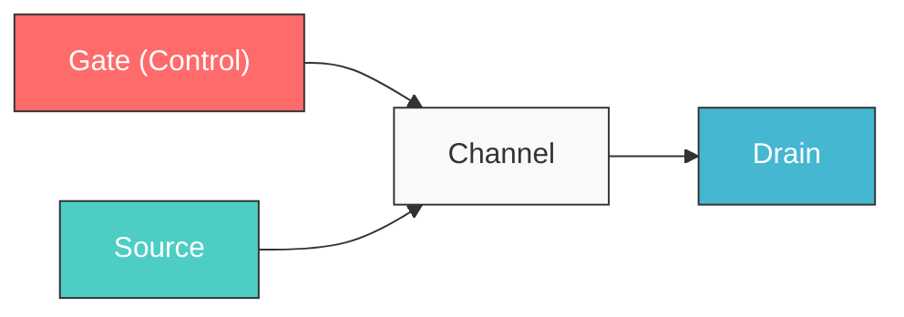

There are two flavors:

| Type | Conducts when Gate is... | Pulls output toward... |
|------|--------------------------|------------------------|
| **NMOS** | HIGH (Vdd) | Ground (0) |
| **PMOS** | LOW (0) | Supply (1) |

> **The key insight**: A transistor is not a mystical device. It's a water faucet. Gate voltage = handle. Current = water. That's it.

Modern GPUs use **FinFET** transistors — the "fin" is a 3D gate that wraps around the channel on three sides, giving better electrostatic control at tiny scales:

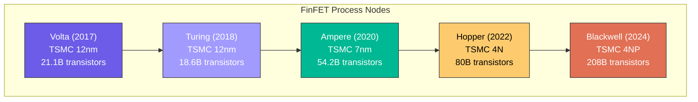

> **208 billion transistors** on Blackwell. That's about 26 transistors for every human alive, on a chip the size of your thumbnail (well, two chips fused together).

---

## 1.2 From Transistors to Logic Gates

Every digital circuit is built from three atomic operations. Here's how transistors make them:

### The NOT Gate (Inverter) — 2 Transistors

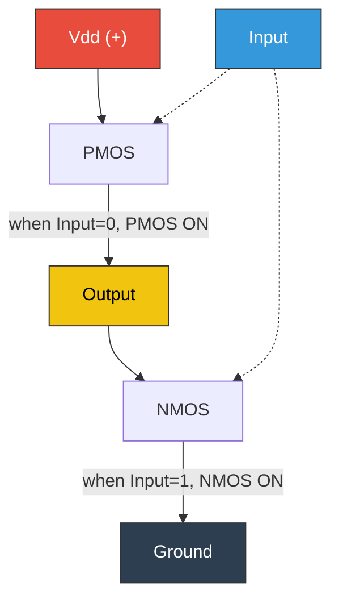

| Input | PMOS | NMOS | Output |
|-------|------|------|--------|
| 0 | ON | OFF | **1** |
| 1 | OFF | ON | **0** |

### The NAND Gate — 4 Transistors

The NAND gate is the **universal gate** — you can build ANY logic function from NANDs alone.

```
        Vdd
       ┌─┤─┐
   A ──┤P₁ │
       └─┬─┘
       ┌─┤─┐    
   B ──┤P₂ │──── Output (= NOT(A AND B))
       └─┬─┘
       ┌─┤─┐
   A ──┤N₁ │
       └─┬─┘
       ┌─┤─┐
   B ──┤N₂ │
       └─┬─┘
        GND

PMOS: Parallel (either A=0 OR B=0 → output=1)
NMOS: Series  (both A=1 AND B=1 → output=0)
```

| A | B | NAND(A,B) |
|---|---|-----------|
| 0 | 0 | **1** |
| 0 | 1 | **1** |
| 1 | 0 | **1** |
| 1 | 1 | **0** |

> **Why NAND is universal**: `NOT(A) = NAND(A,A)`. `AND(A,B) = NOT(NAND(A,B))`. `OR(A,B) = NAND(NOT(A), NOT(B))`. Every other gate follows. This is why chip designers think in NANDs.

---

## 1.3 From Gates to an ALU

An ALU is just a **network of gates** that performs arithmetic. Let's build one from the bottom up.

### Half Adder — The Atom of Arithmetic

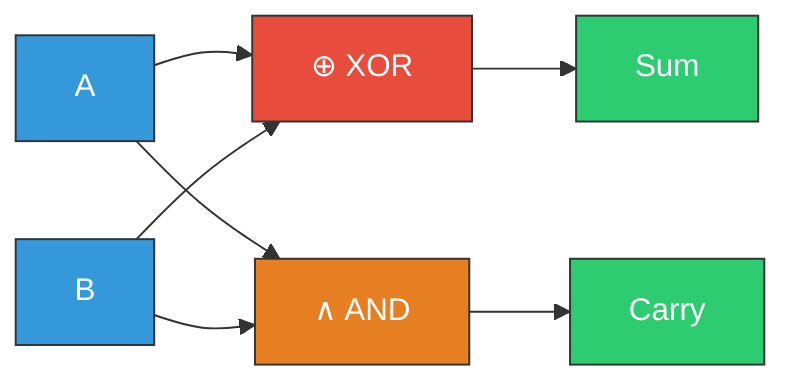

$$Sum = A \oplus B$$
$$Carry = A \wedge B$$

### Full Adder — Handles a Carry-In

$$Sum = A \oplus B \oplus C_{in}$$
$$C_{out} = (A \wedge B) \lor (C_{in} \wedge (A \oplus B))$$

**Gate count**: ~9 gates = ~36 transistors per bit.

### 32-bit Adder

Chain 32 full adders. But naive chaining is slow (carry ripples through all 32 bits). GPUs use **Carry-Lookahead Adders (CLA)**:

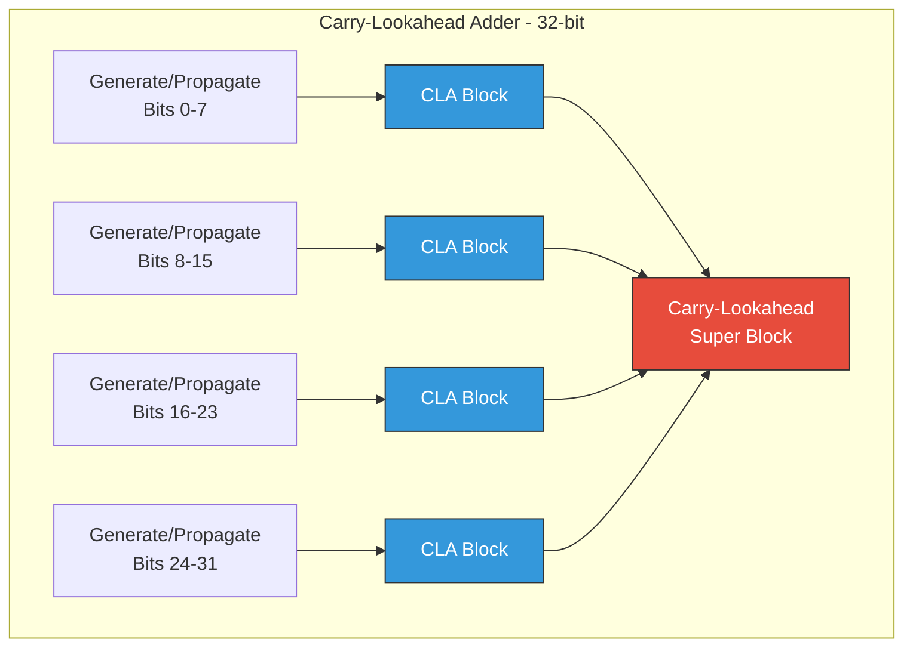

**Key math**: For each bit position *i*:
- **Generate**: $G_i = A_i \wedge B_i$ (this bit produces a carry regardless)
- **Propagate**: $P_i = A_i \oplus B_i$ (this bit passes a carry through)
- **Carry**: $C_i = G_i \lor (P_i \wedge C_{i-1})$

The lookahead trick: expand the recursion so all carries compute in $O(\log n)$ gate delays instead of $O(n)$.

**Total for a 32-bit CLA**: ~200 gates ≈ ~800 transistors. Delay: ~4-5 gate stages.

---

## 1.4 The CUDA Core: A Bare-Metal FPU

Now let's build an actual floating-point unit. An FP32 number (IEEE 754):

```
┌──────┬──────────┬───────────────────────┐
│ Sign │ Exponent │      Mantissa         │
│ 1 bit│  8 bits  │      23 bits          │
└──────┴──────────┴───────────────────────┘

Value = (-1)^sign × 2^(exponent-127) × 1.mantissa
```

### FP32 Multiply Pipeline

To compute $A \times B$:

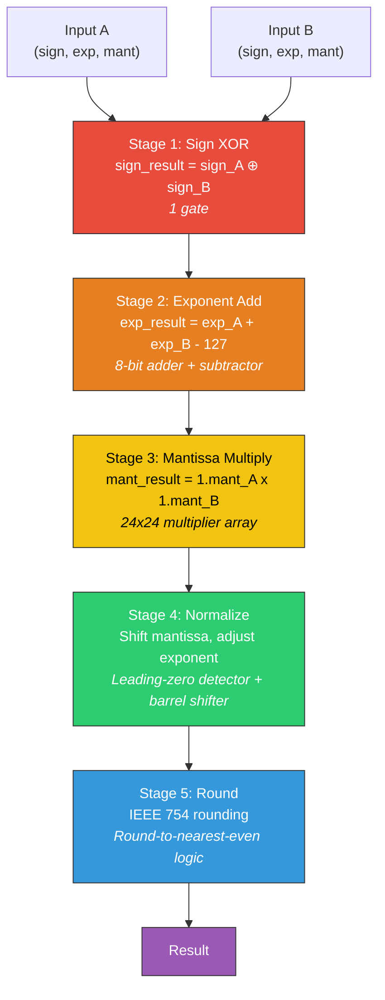

The **24×24 mantissa multiplier** is the big one. Using a Wallace tree multiplier: ~2,000-3,000 gates.

**Total transistor count for one FP32 CUDA core**: approximately **8,000–20,000 transistors**.

> **Compare to a CPU core**: An Intel Golden Cove core has ~500 million transistors. A CUDA core has ~15,000. That's a factor of **30,000×**. A CUDA core is *stupidly simple* by design. That's the point.

### What a CUDA Core Does NOT Have

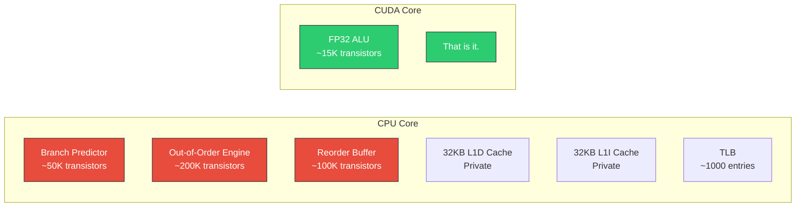

No branch predictor. No out-of-order execution. No speculation. No private cache. Just: **input → ALU → output**. The GPU's philosophy is: *"Why predict branches when you can just run 10,000 threads and always have something useful to do?"*

---

## 1.5 SIMT: How 32 Threads Breathe Together

### The Warp — The Atom of GPU Execution

A **warp** is 32 threads that execute the **same instruction** at the **same time** on 32 different data.

This is **SIMT** — Single Instruction, Multiple Threads. It's like SIMD (SSE/AVX), but each "lane" has its own registers and can branch independently (since Volta).

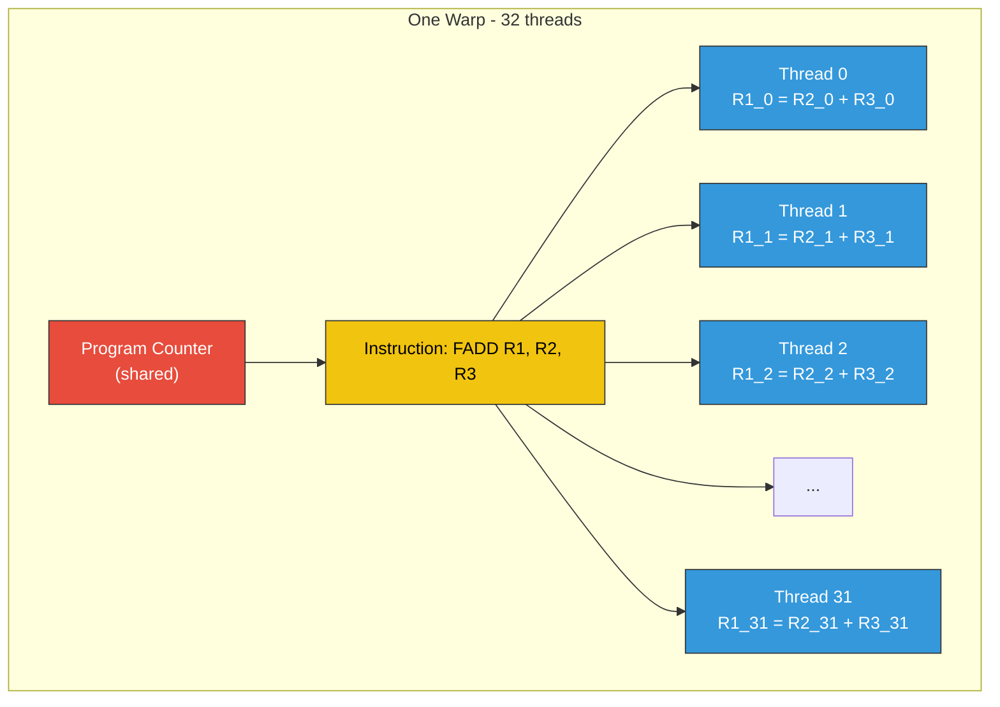

**The hardware implementation**: The warp scheduler fetches ONE instruction. The dispatch unit sends it to 32 CUDA cores simultaneously. Each core reads from its own register bank and writes to its own register bank. One instruction, 32 executions. That's a **32× multiplier on instruction fetch/decode efficiency** compared to a scalar processor.

### Thread Identity

```cuda
// Every thread knows exactly where it is:
int globalId = blockIdx.x * blockDim.x + threadIdx.x;
int warpId   = threadIdx.x / 32;    // which warp within this block
int laneId   = threadIdx.x % 32;    // which lane within the warp (0-31)
```

---

## 1.6 The Streaming Multiprocessor (SM)

The SM is the **fundamental compute unit** of a GPU. Everything above (cores, warps, schedulers) lives inside one SM.

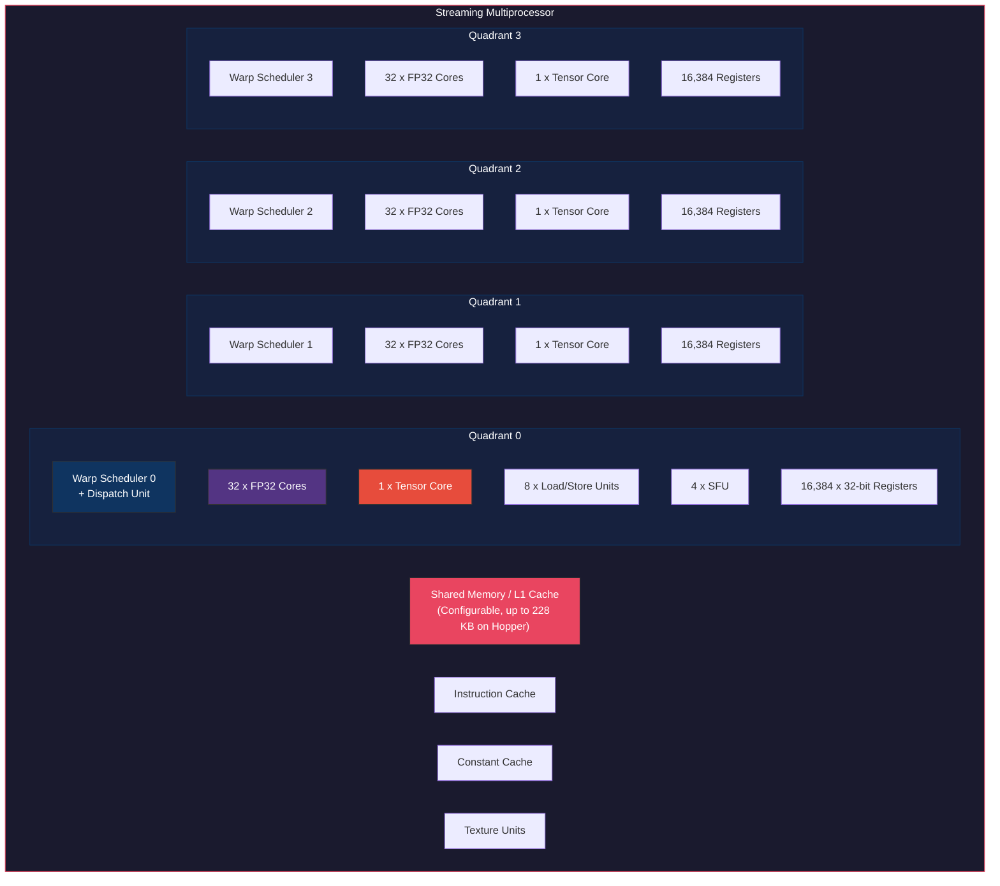

### SM Specs Across Generations

| Feature | Volta (SM70) | Ampere (SM80) | Hopper (SM90) | Blackwell (SM100) |
|---------|-------------|---------------|---------------|-------------------|
| FP32 Cores/SM | 64 | 128 | 128 | 128 |
| Tensor Cores/SM | 8 | 4 (2x capable) | 4 (4th gen) | 4 (5th gen) |
| Register File | 256 KB | 256 KB | 256 KB | 256 KB |
| Shared Mem (max) | 96 KB | 164 KB | 228 KB | 228 KB |
| Max Threads/SM | 2048 | 2048 | 2048 | 2048 |
| Max Warps/SM | 64 | 64 | 64 | 64 |
| Warp Schedulers | 4 | 4 | 4 | 4 |
| Max Blocks/SM | 32 | 32 | 32 | 32 |

> **The golden ratio of GPUs**: 2048 threads / 256 KB registers = 128 bytes (32 registers) per thread at 100% occupancy. Every register you add above 32 reduces your occupancy. This is the *fundamental tradeoff* of GPU programming.

---

## 1.7 Warp Divergence: The Cost of `if`

Consider this code:

```cuda
__global__ void divergent_kernel(float* data, int N) {
    int idx = blockIdx.x * blockDim.x + threadIdx.x;
    if (idx % 2 == 0) {
        data[idx] = expensive_function_A(data[idx]);  // Even threads
    } else {
        data[idx] = expensive_function_B(data[idx]);  // Odd threads
    }
}
```

### What Happens Inside the Warp

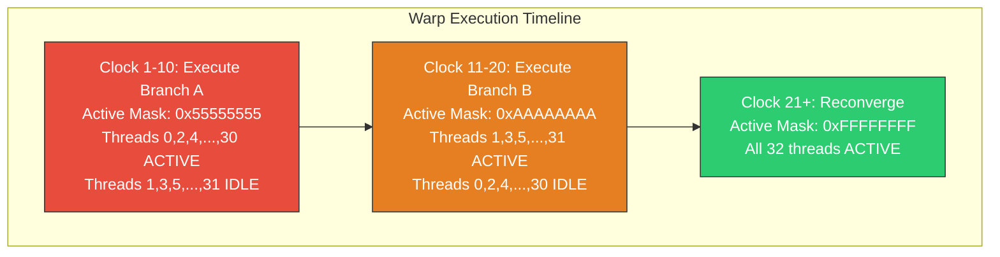

**Throughput**: Both branches execute sequentially. If each branch takes 10 cycles, the divergent warp takes **20 cycles** instead of 10. That's **50% efficiency**.

**The hardware truth**: Those "idle" CUDA cores aren't powered down — they're executing the instruction but their **write-back is masked**. The energy is mostly wasted.

### The Fix: Think in Warps, Not Threads

```cuda
// GOOD: All threads in a warp take the same branch
__global__ void coalesced_kernel(float* data, int N) {
    int warpId = (blockIdx.x * blockDim.x + threadIdx.x) / 32;
    int laneId = threadIdx.x % 32;

    if (warpId % 2 == 0) {
        // Entire warp goes here — no divergence
        data[warpId * 32 + laneId] = expensive_function_A(data[warpId * 32 + laneId]);
    } else {
        // Entire warp goes here — no divergence
        data[warpId * 32 + laneId] = expensive_function_B(data[warpId * 32 + laneId]);
    }
}
```

---

# Hour 2 — Memory: The Real Bottleneck

> *"The speed of computation doesn't matter if you can't feed the beast."*

## 2.1 The Memory Hierarchy: A Map of Latencies

This is the single most important diagram in GPU programming:

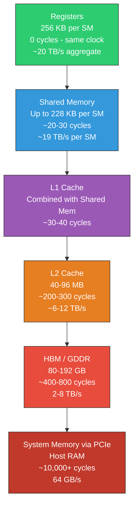

> **The fundamental equation**: At 1.5 GHz, 400 cycles = **267 nanoseconds**. A single global memory access takes as long as 400 floating-point operations. This is why GPUs need **thousands of threads** — to keep the ALUs busy while other threads wait for memory.

Let me put it differently. Say each of your threads needs data from HBM. At 400 cycles per access, you need:

$$\text{Warps needed to hide latency} = \frac{\text{Memory latency}}{\text{Instruction throughput}} = \frac{400 \text{ cycles}}{4 \text{ cycles/instruction}} = 100 \text{ warps}$$

But we only have 64 warps per SM. So we **need** shared memory and caches to reduce effective latency, or we'll always be memory-bound.

---

## 2.2 Registers: Zero-Cost Storage

Registers are the fastest memory in the system. Each SM has **65,536 x 32-bit registers** (256 KB).

```cuda
__global__ void register_demo(float* out, float* in, int N) {
    int idx = blockIdx.x * blockDim.x + threadIdx.x;

    // These live in REGISTERS — zero-cost access
    float a = in[idx];          // Register R1
    float b = in[idx + N];      // Register R2
    float c = a * b;            // Register R3 = R1 * R2
    float d = c + 1.0f;         // Register R4 = R3 + 1.0
    out[idx] = d;               // Store R4 to memory
}
```

**Register pressure** — the critical tradeoff:

```
Total registers per SM:           65,536
Max threads per SM:                2,048
Registers at 100% occupancy:  65,536 / 2,048 = 32 registers per thread

If your kernel uses 64 registers/thread:
  Threads per SM = 65,536 / 64 = 1,024 threads = 32 warps
  Occupancy = 32/64 = 50%

If your kernel uses 128 registers/thread:
  Threads per SM = 65,536 / 128 = 512 threads = 16 warps
  Occupancy = 16/64 = 25%
```

> **Feynman's rule**: *Every register you add above 32 is stealing occupancy from you.* But sometimes that's a good trade — more registers means fewer memory accesses. Profile, don't guess.

### PTX Register Usage

```
// PTX: Registers are explicitly declared
.reg .f32 %f<64>;    // 64 FP32 registers: %f0 through %f63
.reg .f64 %fd<16>;   // 16 FP64 registers
.reg .b32 %r<32>;    // 32 32-bit general registers
.reg .b64 %rd<16>;   // 16 64-bit registers (for addresses)
.reg .pred %p<8>;    // 8 predicate registers (for branching)

// Usage:
ld.global.f32 %f0, [%rd0];       // Load from global memory to register
add.f32       %f1, %f0, %f2;     // Add two registers
st.global.f32 [%rd1], %f1;       // Store register to global memory
```

---

## 2.3 Shared Memory & Bank Conflicts

Shared memory is on-chip SRAM, accessible by all threads in a **thread block** (CTA). It's 20-30x faster than global memory.

### Physical Structure: 32 Banks

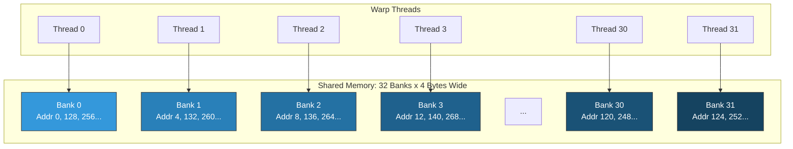

**Bank formula**: `bank(address) = (address / 4) % 32`

### The Three Cases

```cuda
__shared__ float smem[1024];

// CASE 1: No conflict — stride-1 access (perfect)
float val = smem[threadIdx.x];
// Thread 0 -> Bank 0, Thread 1 -> Bank 1, ..., Thread 31 -> Bank 31
// One cycle. 32 simultaneous reads.

// CASE 2: 2-way conflict — stride-2 access
float val = smem[threadIdx.x * 2];
// Thread 0 -> Bank 0, Thread 16 -> Bank 0 (CONFLICT!)
// Thread 1 -> Bank 2, Thread 17 -> Bank 2 (CONFLICT!)
// Two cycles instead of one. 50% throughput.

// CASE 3: 32-way conflict — stride-32 access (catastrophic)
float val = smem[threadIdx.x * 32];
// ALL threads -> Bank 0
// 32 cycles instead of 1. 3.125% throughput.

// CASE 4: Broadcast — all read SAME address (free!)
float val = smem[0];
// All 32 threads read address 0 -> Bank 0 broadcasts. One cycle.
```

### Bank Conflict Diagram

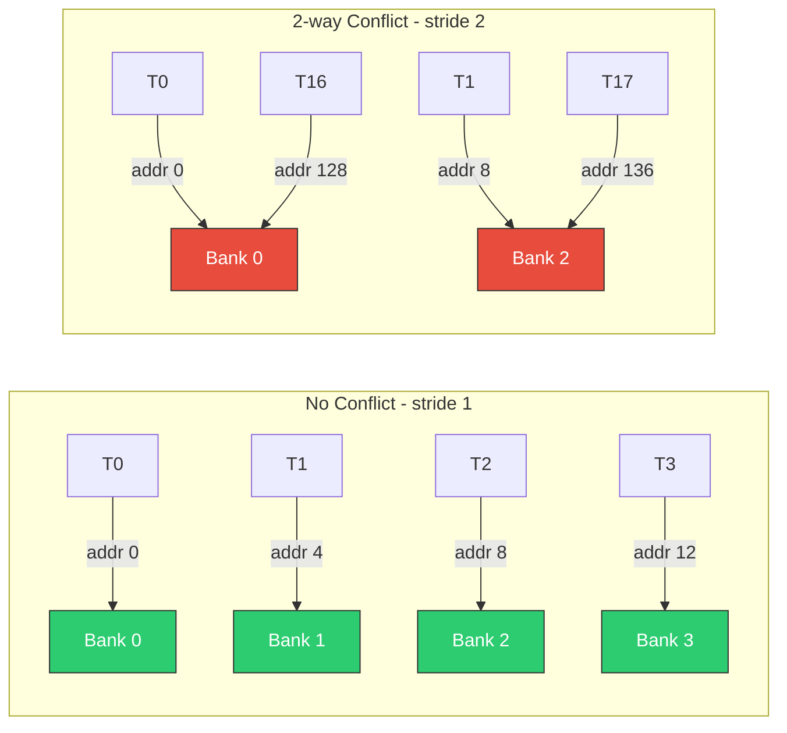

### Fixing Bank Conflicts: Padding

```cuda
// Problem: column-major access to a 32-wide array
__shared__ float tile[32][32];   // smem[row][col]
// Accessing column: tile[threadIdx.x][col] -> stride-32 -> 32-way conflict!

// Fix: add padding
__shared__ float tile[32][32 + 1];  // 33 columns
// Now stride is 33, and 33 % 32 = 1 -> perfect stride-1 access!
// One wasted float per row, but 32x throughput improvement.
```

---

## 2.4 Global Memory & Coalescing

Global memory (HBM) is accessed through **128-byte cache lines**. The hardware **coalesces** requests from all 32 threads in a warp into the minimum number of transactions.

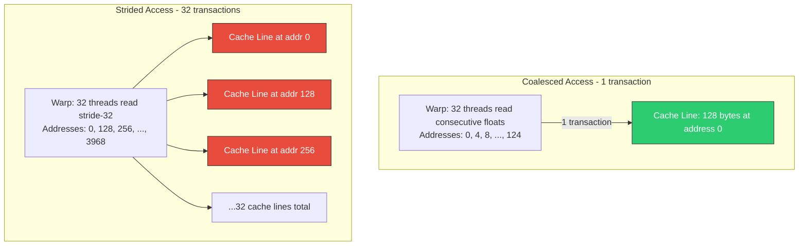

### The Coalescing Hardware

Inside each SM's Load/Store Unit (LSU):

1. Collect all 32 addresses from the warp
2. Sort them by 128-byte aligned segment
3. Issue one memory transaction per unique segment
4. Route returned bytes to correct thread registers

```cuda
// Perfectly coalesced — 1 transaction per warp
__global__ void coalesced(float* data) {
    int idx = blockIdx.x * blockDim.x + threadIdx.x;
    float val = data[idx];  // Threads 0-31 read addresses 0-124
}

// Strided — 32 transactions per warp (32x slower)
__global__ void strided(float* data, int stride) {
    int idx = threadIdx.x * stride;
    float val = data[idx];  // Each thread hits a different cache line
}

// Random — up to 32 transactions per warp
__global__ void random_access(float* data, int* indices) {
    float val = data[indices[threadIdx.x]];  // Unpredictable addresses
}
```

### Coalescing Math

For a warp accessing addresses $a_0, a_1, \ldots, a_{31}$:

$$\text{Transactions} = \left|\left\lbrace \left\lfloor \frac{a_i}{128} \right\rfloor \mid i \in [0, 31] \right\rbrace\right|$$

i.e., the number of **distinct 128-byte aligned segments** touched.

**Best case**: 1 transaction (128 bytes), all data used → **100% efficiency**

**Worst case**: 32 transactions (4096 bytes), only 128 bytes used → **3.125% efficiency**

---

## 2.5 Occupancy: The Art of Hiding Latency

**Occupancy** = Active warps / Maximum warps per SM

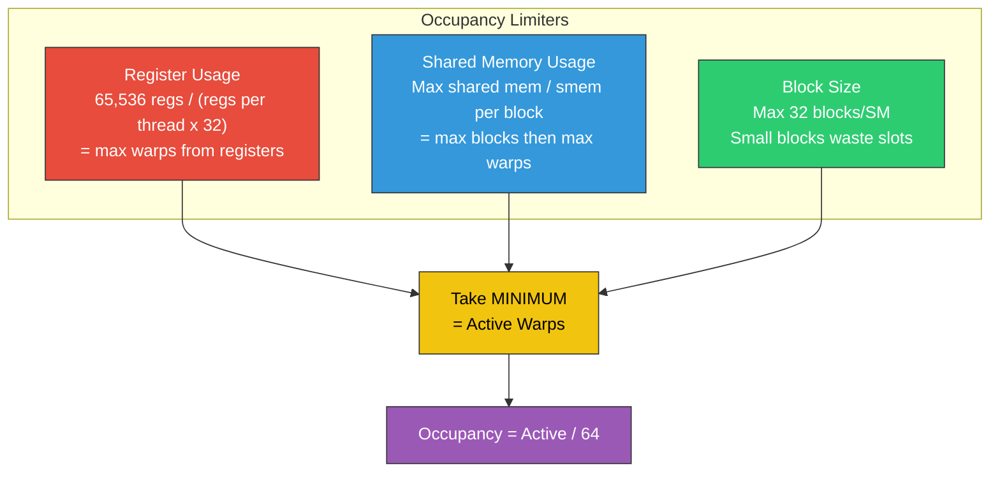

### Worked Example

```
Kernel: 256 threads/block, 48 regs/thread, 16 KB shared memory
GPU: SM90 (Hopper)

Register limit:
  65,536 regs / (48 regs x 256 threads) = 65,536 / 12,288 = 5.33 -> 5 blocks
  5 blocks x 256 threads = 1,280 threads = 40 warps

Shared memory limit:
  228 KB / 16 KB = 14.25 -> 14 blocks
  14 blocks x 256 threads = 3,584 -> but max is 2,048 -> 64 warps

Block count limit:
  32 blocks max -> 32 x 256 = 8,192 -> capped at 2,048 -> 64 warps

Final: min(40, 64, 64) = 40 warps -> Occupancy = 40/64 = 62.5%
```

> **Feynman's warning**: *Don't worship occupancy.* Sometimes 50% occupancy with 64 registers per thread beats 100% occupancy with 32 registers, because you avoid expensive memory spills. The occupancy calculator is a guide, not a god.

---

## 2.6 The Warp Scheduler: Juggling Latency

Each SM has **4 warp schedulers**, each managing a pool of warps. Every cycle, each scheduler:

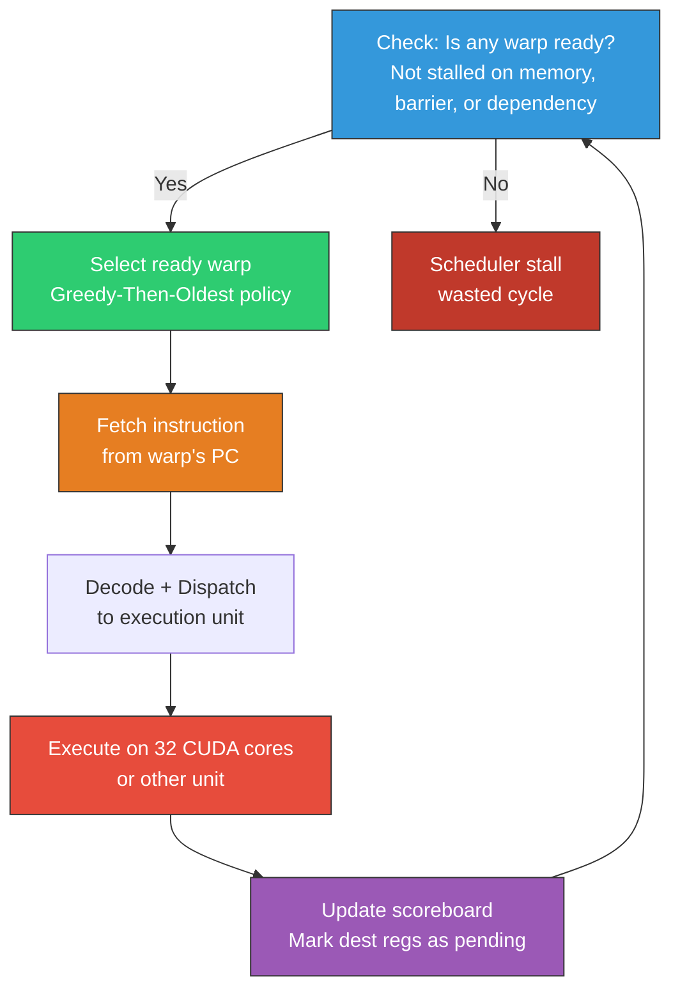

### The Scoreboard

Each warp has a **scoreboard** — a bit vector tracking which registers have pending writes:

```
Warp 7 Scoreboard:
  R0: ready    R8:  ready    R16: PENDING (waiting for LD)
  R1: ready    R9:  ready    R17: ready
  R2: PENDING  R10: ready    R18: ready
  ...

If next instruction is: ADD R5, R2, R3
  -> R2 is PENDING -> warp 7 is STALLED
  -> Scheduler picks another warp
```

This is why GPUs **need many warps**: every memory access stalls a warp for hundreds of cycles. The scheduler swaps to another warp **in zero cycles** (zero-cost context switching, because all warp state is always resident in registers).

### Latency Hiding Math

For a **memory-bound** kernel:

$$\text{Warps needed} \geq \frac{\text{Memory latency (cycles)}}{\text{Cycles between memory ops}} $$

Example: Memory latency = 400 cycles, one memory op every 8 arithmetic instructions (4 cycles each = 32 cycles):

$$\text{Warps needed} \geq \frac{400}{32} = 12.5 \rightarrow 13 \text{ warps per scheduler}$$

With 4 schedulers: **52 warps minimum** → ~81% occupancy needed.

---

# Hour 3 — The Generational Leap: Volta → Ampere → Hopper

## 3.1 Tensor Cores: Why Multiply-Accumulate Is King

Deep learning is dominated by one operation: **matrix multiply-accumulate (MMA)**.

$$D = A \times B + C$$

Where $A$ is $M \times K$, $B$ is $K \times N$, and $C, D$ are $M \times N$.

The arithmetic intensity of matrix multiplication:

$$\text{FLOPs} = 2 \times M \times N \times K$$
$$\text{Bytes loaded} = (M \times K + K \times N + M \times N) \times \text{bytes per element}$$
$$\text{Arithmetic intensity} = \frac{2MNK}{(MK + KN + MN) \times b}$$

For large square matrices ($M = N = K$): intensity $\approx \frac{2K}{3b}$, which **grows with matrix size**. This is why GPUs love large GEMMs — they become compute-bound, not memory-bound.

A **Tensor Core** is a specialized circuit that computes a small MMA (e.g., 4x4x4) in a **single clock cycle**, rather than requiring 128 individual FMA (fused multiply-add) operations.

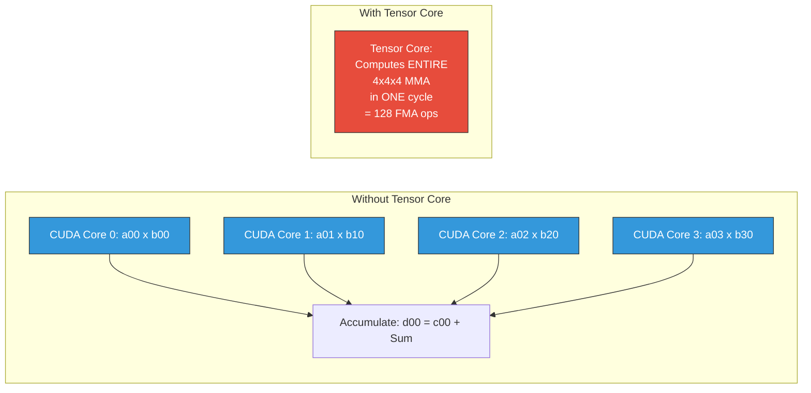

---

## 3.2 Volta (SM70): Where Tensor Cores Were Born

**Volta** (2017) introduced the **1st generation Tensor Core** and **independent thread scheduling**.

### Tensor Core V1: 4x4x4 FP16 to FP32

Each Tensor Core computes: $D_{4 \times 4} = A_{4 \times 4} \cdot B_{4 \times 4} + C_{4 \times 4}$

- **Input**: FP16 (A, B)
- **Accumulate**: FP32 (C, D)
- **Per Tensor Core per clock**: 64 FMA operations
- **8 Tensor Cores per SM**: 512 FMA ops/SM/clock

### CUDA: WMMA API

```cuda
#include <mma.h>
using namespace nvcuda;

__global__ void volta_wmma_gemm(half* A, half* B, float* C, float* D,
                                 int M, int N, int K) {
    // Declare fragments for a 16x16x16 tile
    wmma::fragment<wmma::matrix_a, 16, 16, 16, half, wmma::row_major> a_frag;
    wmma::fragment<wmma::matrix_b, 16, 16, 16, half, wmma::col_major> b_frag;
    wmma::fragment<wmma::accumulator, 16, 16, 16, float> c_frag;

    // Initialize accumulator to zero
    wmma::fill_fragment(c_frag, 0.0f);

    // Compute warp's tile position
    int warpM = (blockIdx.x * blockDim.x + threadIdx.x) / 32 / (N/16);
    int warpN = (blockIdx.x * blockDim.x + threadIdx.x) / 32 % (N/16);
    int row = warpM * 16;
    int col = warpN * 16;

    // Loop over K dimension in tiles of 16
    for (int k = 0; k < K; k += 16) {
        // Load A and B tiles from global memory
        wmma::load_matrix_sync(a_frag, A + row * K + k, K);
        wmma::load_matrix_sync(b_frag, B + k * N + col, N);

        // Tensor Core MMA: C += A x B
        wmma::mma_sync(c_frag, a_frag, b_frag, c_frag);
    }

    // Store result
    wmma::store_matrix_sync(D + row * N + col, c_frag, N, wmma::mem_row_major);
}
```

### PTX: wmma.mma.sync

```
// PTX for Volta WMMA (16x16x16, FP16 to FP32)
// Warp-synchronous — all 32 threads participate

// Declare register fragments
.reg .f32 %acc<8>;       // 8 accumulator registers per thread (16x16 / 32 threads)
.reg .b32 %a<4>;         // A fragment (packed FP16)
.reg .b32 %b<4>;         // B fragment (packed FP16)

// Load A fragment from shared memory
wmma.load.a.sync.aligned.m16n16k16.shared.row.f16
    {%a0, %a1, %a2, %a3}, [smem_a_addr], stride_a;

// Load B fragment from shared memory
wmma.load.b.sync.aligned.m16n16k16.shared.col.f16
    {%b0, %b1, %b2, %b3}, [smem_b_addr], stride_b;

// Tensor Core MMA
wmma.mma.sync.aligned.m16n16k16.row.col.f32.f16.f16.f32
    {%acc0, %acc1, %acc2, %acc3, %acc4, %acc5, %acc6, %acc7},
    {%a0, %a1, %a2, %a3},
    {%b0, %b1, %b2, %b3},
    {%acc0, %acc1, %acc2, %acc3, %acc4, %acc5, %acc6, %acc7};
```

> **Key insight**: The `wmma.mma.sync` is **warp-synchronous** — all 32 threads must execute it together. Each thread contributes a piece of the A, B, and C matrices. The Tensor Core hardware does the reduction internally.

---

## 3.3 Ampere (SM80): Async Copy & mbarrier

**Ampere** (2020) brought three game-changers:
1. **3rd-gen Tensor Cores** (TF32, BF16, FP64, structured sparsity)
2. **cp.async** — hardware asynchronous copy from global to shared memory
3. **mbarrier** — hardware-accelerated synchronization primitive

### cp.async: Bypass the Register File

Before Ampere, loading from global to shared memory required:

```
Global Memory -> Register -> Shared Memory   (2 steps, registers busy)
```

Ampere's `cp.async` does it in one hardware step:

```
Global Memory -> Shared Memory   (1 step, registers free!)
```

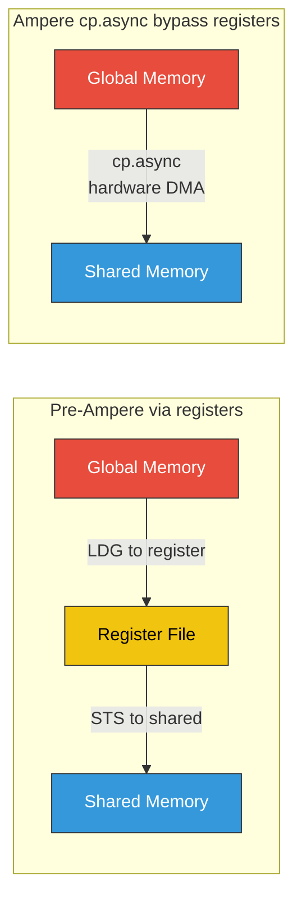

### CUDA cp.async

```cuda
#include <cuda_pipeline.h>

__global__ void async_copy_kernel(float4* global_data, int N) {
    __shared__ float4 smem_buffer[2][64];  // Double buffer

    int tid = threadIdx.x;
    int stage = 0;

    // Stage 0: Issue first async copy
    __pipeline_memcpy_async(&smem_buffer[0][tid],
                            &global_data[tid], sizeof(float4));
    __pipeline_commit();

    for (int i = 1; i < N; i++) {
        int next_stage = stage ^ 1;  // Toggle 0 <-> 1

        // Issue async copy for NEXT tile
        __pipeline_memcpy_async(&smem_buffer[next_stage][tid],
                                &global_data[i * 64 + tid], sizeof(float4));
        __pipeline_commit();

        // Wait for CURRENT tile to be ready
        __pipeline_wait_prior(1);  // Wait until only 1 group pending
        __syncthreads();

        // Compute on current tile
        compute(smem_buffer[stage]);

        stage = next_stage;
    }

    // Process last tile
    __pipeline_wait_prior(0);
    __syncthreads();
    compute(smem_buffer[stage]);
}
```

### PTX: cp.async

```
// Copy 16 bytes from global to shared memory, asynchronously
cp.async.ca.shared.global [smem_addr], [global_addr], 16;

// Commit this group of copies
cp.async.commit_group;

// Wait until at most N groups are still pending
cp.async.wait_group N;

// Wait for ALL pending copies
cp.async.wait_all;
```

### Ampere's Structured Sparsity (2:4)

Ampere introduced hardware-accelerated **2:4 structured sparsity**: in every group of 4 elements, at least 2 must be zero.

```
Dense:    [0.5, 0.0, 0.3, 0.0, 0.7, 0.0, 0.1, 0.0]
Sparse:   [0.5, 0.3, 0.7, 0.1]  + metadata: [0,2,0,2]
```

The Tensor Core skips zero multiplications → **2x throughput**.

---

## 3.4 Deep Dive: mbarrier — Phase-Based Synchronization

> *"Synchronization is the tax you pay for parallelism. mbarrier reduces that tax."*

### Why Not Just `__syncthreads()`?

`__syncthreads()` is a **sledgehammer**: it forces ALL threads in a block to reach the same point. It knows nothing about asynchronous operations. It's block-scoped only.

**mbarrier** is a **scalpel**: it can track async operations (like `cp.async`), works across CTAs in a cluster, and uses phases for pipelining.

| Feature | `__syncthreads()` | `mbarrier` |
|---------|-------------------|-----------|
| Scope | Block-level only | Flexible (warp, block, cross-CTA in cluster) |
| Async awareness | No | Yes — can track async operations |
| Hardware support | Barrier instruction | Dedicated hardware unit in SM |
| Phase tracking | No | Yes — alternating phases |
| Completion tracking | Thread arrival only | Thread arrival + async byte count |

### The mbarrier State Machine

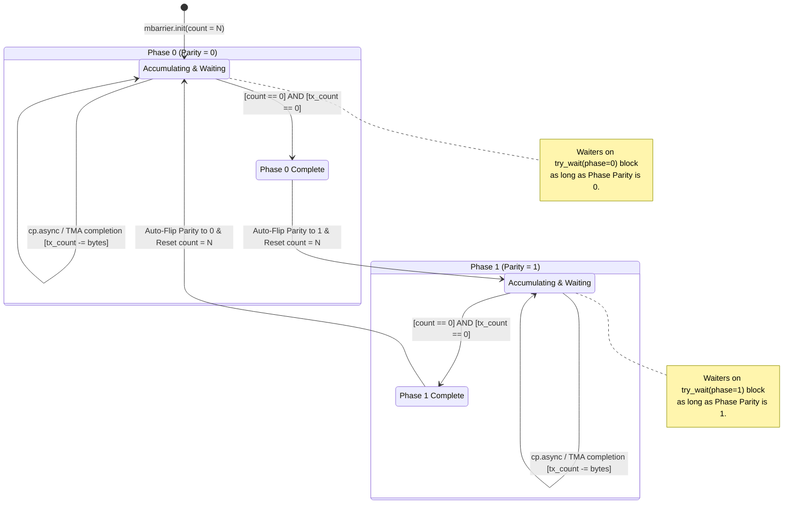

> **Phase 0 note**: Threads call `mbarrier.arrive()`, async ops arrive automatically. Waiters spin on `try_wait(phase=0)`.
>
> **Phase 1 note**: Same mechanism, opposite phase. Allows pipelining stages.

### The mbarrier Object in Memory

An mbarrier lives in **shared memory** as an 8-byte (64-bit) opaque object:

```
Bits 63-32: Pending async byte count (for cp.async tracking)
Bits 31-16: Arrival count remaining
Bit  0:     Phase bit (alternates 0 and 1)
```

The hardware manages these bits atomically.

### Complete PTX mbarrier Example: Multi-Stage Pipeline

```
// ============================================
// Multi-stage async pipeline using mbarrier
// ============================================

.shared .align 8  .b64 mbar[4];              // 4 mbarrier objects (4 stages)
.shared .align 128 .b8  smem_buf[4][TILE_SZ]; // 4 stage buffers

// --- Initialization (thread 0 only) ---
.reg .pred %is_t0;
setp.eq.u32 %is_t0, %tid, 0;

@%is_t0 mbarrier.init.shared.b64 [mbar + 0],  %block_size;
@%is_t0 mbarrier.init.shared.b64 [mbar + 8],  %block_size;
@%is_t0 mbarrier.init.shared.b64 [mbar + 16], %block_size;
@%is_t0 mbarrier.init.shared.b64 [mbar + 24], %block_size;
bar.sync 0;  // Ensure init is visible to all threads

// --- Prologue: Fill the pipeline ---
// Stage 0: Issue async copy and arrive
cp.async.ca.shared.global [smem_buf + 0 + %tid_offset],
                           [global_addr_0 + %tid_offset], 16;
cp.async.commit_group;
mbarrier.arrive.expect_tx.shared.b64 %state, [mbar + 0], 16;
    // Tell the barrier: "expect 16 more bytes from async ops"

// Stage 1: Issue async copy
cp.async.ca.shared.global [smem_buf + TILE_SZ + %tid_offset],
                           [global_addr_1 + %tid_offset], 16;
cp.async.commit_group;
mbarrier.arrive.expect_tx.shared.b64 %state, [mbar + 8], 16;

// --- Main Loop ---
.reg .u32 %stage;
mov.u32 %stage, 0;

MAIN_LOOP:
    // Wait for current stage data to be ready
    .reg .u64 %mbar_addr;
    // compute %mbar_addr = mbar + (%stage % 4) * 8
    .reg .pred %wait_done;
    
    TRY_WAIT:
    mbarrier.try_wait.parity.shared.b64 %wait_done, [%mbar_addr], %phase;
    @!%wait_done bra TRY_WAIT;
    // Data is ready! Proceed.

    // Issue async copy for stage+2 (prefetch ahead)
    // ... (similar cp.async + mbarrier.arrive.expect_tx) ...

    // Compute on current stage data
    ld.shared.f32 %f0, [%current_buf + %tid_offset];
    // ... computation ...
    st.global.f32 [%output + %tid_offset], %f_result;

    // Advance
    add.u32 %stage, %stage, 1;
    setp.lt.u32 %p_loop, %stage, %num_tiles;
    @%p_loop bra MAIN_LOOP;
```

### mbarrier with TMA (Hopper+)

On Hopper, the **TMA hardware** automatically arrives at an mbarrier when its copy completes — no thread intervention needed:

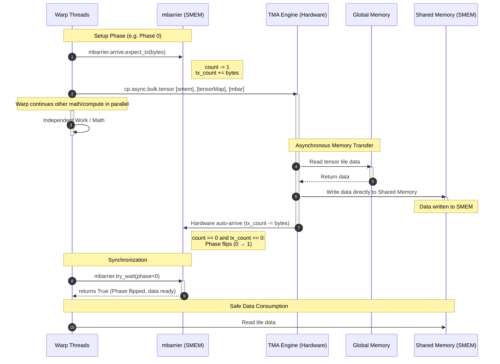

---

## 3.5 Hopper (SM90): TMA, Clusters & WGMMA

**Hopper** (2022) was a quantum leap. Three major innovations:

### 1. Thread Block Clusters

A **cluster** is a group of up to 8 CTAs (thread blocks) that are **guaranteed to be co-scheduled** on the same GPC.

```mermaid
graph TD
    subgraph GPC0["GPC 0"]
        subgraph Cluster["Thread Block Cluster"]
            CTA0["CTA 0<br/>SM 0<br/>Shared Mem 0"]
            CTA1["CTA 1<br/>SM 1<br/>Shared Mem 1"]
            CTA2["CTA 2<br/>SM 2<br/>Shared Mem 2"]
            CTA3["CTA 3<br/>SM 3<br/>Shared Mem 3"]
            
            CTA0 <-->|"DSMEM"| CTA1
            CTA1 <-->|"DSMEM"| CTA2
            CTA2 <-->|"DSMEM"| CTA3
            CTA0 <-->|"DSMEM"| CTA3
        end
    end

    style Cluster fill:#1a1a2e,stroke:#e94560,color:#fff
    style CTA0 fill:#16213e,stroke:#0f3460,color:#fff
    style CTA1 fill:#16213e,stroke:#0f3460,color:#fff
    style CTA2 fill:#16213e,stroke:#0f3460,color:#fff
    style CTA3 fill:#16213e,stroke:#0f3460,color:#fff
```

**Distributed Shared Memory (DSMEM)**: CTA 0 can directly read/write CTA 1's shared memory — no global memory round-trip needed.

```cuda
__cluster_dims__(4, 1, 1)  // 4 CTAs in a cluster
__global__ void cluster_kernel() {
    // Get cluster info
    auto cluster = cooperative_groups::this_cluster();
    extern __shared__ int smem[];

    // Access another CTA's shared memory directly!
    int target_cta = (cluster.block_rank() + 1) % cluster.num_blocks();
    int* remote_smem = cluster.map_shared_rank(smem, target_cta);

    // Direct cross-CTA shared memory access (via DSMEM)
    int val = *remote_smem;  // No global memory needed!
}
```

### 2. Tensor Memory Accelerator (TMA)

The TMA is a **dedicated hardware engine** in each SM that moves multi-dimensional tensor tiles between global memory and shared memory.

```mermaid
graph LR
    subgraph "Without TMA - Manual Tiling"
        direction TB
        T0["Thread 0: load gmem 0 to reg to smem 0"]
        T1["Thread 1: load gmem 1 to reg to smem 1"]
        T2["Thread 2: load gmem 2 to reg to smem 2"]
        DOTS["...128 threads doing address math"]
    end

    subgraph "With TMA - 1 thread 1 instruction"
        direction TB
        TMA["TMA Engine:<br/>cp.async.bulk.tensor.2d<br/>[smem], [tensorMap, coords], [mbar]<br/><br/>Handles:<br/>- Address calculation<br/>- Bounds checking<br/>- Swizzling<br/>- Format conversion<br/>- mbarrier notification"]
    end

    style TMA fill:#e74c3c,stroke:#333,color:#fff
    style T0 fill:#95a5a6,stroke:#333,color:#fff
    style T1 fill:#95a5a6,stroke:#333,color:#fff
    style T2 fill:#95a5a6,stroke:#333,color:#fff
```

### TMA Setup (Host Side)

```cuda
// Create a tensor map descriptor on the host
CUtensorMap tensorMap;
CUresult result = cuTensorMapEncodeTiled(
    &tensorMap,
    CU_TENSOR_MAP_DATA_TYPE_FLOAT16,    // Element type
    2,                                    // Number of dimensions
    globalPtr,                            // Base pointer in global memory
    globalDim,                            // {rows, cols} of global tensor
    globalStrides,                        // {stride_row_bytes, stride_col_bytes}
    boxDim,                               // {tile_rows, tile_cols} to transfer
    elementStrides,                       // Element strides
    CU_TENSOR_MAP_INTERLEAVE_NONE,       // Interleaving
    CU_TENSOR_MAP_SWIZZLE_128B,          // Swizzle pattern
    CU_TENSOR_MAP_L2_PROMOTION_L2_128B,  // L2 policy
    CU_TENSOR_MAP_FLOAT_OOB_FILL_NONE    // Out-of-bounds handling
);
```

### TMA PTX (Device Side)

```
// Load a 2D tile from global to shared memory
// Only ONE thread needs to execute this — TMA does all the work
.reg .pred %is_leader;
setp.eq.u32 %is_leader, %tid, 0;

@%is_leader cp.async.bulk.tensor.2d.shared::cluster.global.tile
    .mbarrier::complete_tx::bytes
    [smem_addr],                    // Destination in shared memory
    [tensorMapPtr, {%coord_x, %coord_y}],  // Source: tensor map + coordinates
    [mbar_addr];                    // mbarrier to signal on completion

// All threads wait for TMA to complete
WAIT:
mbarrier.try_wait.parity.shared.b64 %wait_result, [mbar_addr], %phase;
@!%wait_result bra WAIT;
```

### TMA Multicast (Load once, deliver to multiple CTAs)

```
// Load tile and multicast to CTAs 0, 1, 2, 3 in a cluster
@%is_leader cp.async.bulk.tensor.2d.shared::cluster.global.tile
    .mbarrier::complete_tx::bytes
    .multicast::cluster
    [smem_addr],
    [tensorMapPtr, {%coord_x, %coord_y}],
    [mbar_addr],
    %ctaMask;    // Bitmask: 0b1111 = CTAs 0,1,2,3
```

> **Why TMA is revolutionary**: Without TMA, 128 threads waste time computing addresses, doing bounds checks, and issuing individual loads. With TMA, **one instruction** replaces all of that. The freed-up threads do useful compute instead.

---

## 3.6 WGMMA: The Warpgroup Matrix Machine

**WGMMA** (Warpgroup Matrix Multiply-Accumulate) is Hopper's Tensor Core interface. It operates at the **warpgroup** level: 4 warps (128 threads) acting as a unit.

### Why Warpgroups?

```mermaid
graph TD
    subgraph "Volta/Ampere: Warp-level MMA"
        W0["1 Warp = 32 threads<br/>wmma.mma.sync 16x16x16<br/>= 8,192 FLOPs"]
    end
    
    subgraph "Hopper: Warpgroup-level MMA"
        WG["4 Warps = 128 threads<br/>wgmma.mma_async 64x256x16<br/>= 524,288 FLOPs<br/><br/>64x more work per instruction!"]
    end

    style W0 fill:#3498db,stroke:#333,color:#fff
    style WG fill:#e74c3c,stroke:#333,color:#fff
```

### WGMMA Key Innovation

**Operand B can come directly from shared memory** — no need to load it into registers first:

```mermaid
graph LR
    subgraph "Volta wmma"
        SMEM1["Shared Mem"] -->|"load to reg"| REG1["Registers A"]
        SMEM1 -->|"load to reg"| REG2["Registers B"]
        REG1 --> TC1["Tensor Core"]
        REG2 --> TC1
    end
    
    subgraph "Hopper wgmma"
        SMEM2["Shared Mem B"] -->|"direct read"| TC2["Tensor Core"]
        REG3["Registers A"] --> TC2
    end

    style TC1 fill:#3498db,stroke:#333,color:#fff
    style TC2 fill:#e74c3c,stroke:#333,color:#fff
```

> **Key**: B reads shared memory directly! This saves register bandwidth.

### WGMMA PTX

```
// ==========================================
// Hopper WGMMA: 64x256x16 FP16 to FP32
// ==========================================

// Step 1: Fence — ensure memory ordering
wgmma.fence.sync.aligned;

// Step 2: Issue the MMA
// desc_a = 64-bit descriptor for A matrix in shared memory
// desc_b = 64-bit descriptor for B matrix in shared memory
wgmma.mma_async.sync.aligned.m64n256k16.f32.f16.f16
    {%acc0,  %acc1,  %acc2,  %acc3,
     %acc4,  %acc5,  %acc6,  %acc7,
     %acc8,  %acc9,  %acc10, %acc11,
     %acc12, %acc13, %acc14, %acc15,
     %acc16, %acc17, %acc18, %acc19,
     %acc20, %acc21, %acc22, %acc23,
     %acc24, %acc25, %acc26, %acc27,
     %acc28, %acc29, %acc30, %acc31,
     %acc32, %acc33, %acc34, %acc35,
     %acc36, %acc37, %acc38, %acc39,
     %acc40, %acc41, %acc42, %acc43,
     %acc44, %acc45, %acc46, %acc47,
     %acc48, %acc49, %acc50, %acc51,
     %acc52, %acc53, %acc54, %acc55,
     %acc56, %acc57, %acc58, %acc59,
     %acc60, %acc61, %acc62, %acc63,
     %acc64, %acc65, %acc66, %acc67,
     %acc68, %acc69, %acc70, %acc71,
     %acc72, %acc73, %acc74, %acc75,
     %acc76, %acc77, %acc78, %acc79,
     %acc80, %acc81, %acc82, %acc83,
     %acc84, %acc85, %acc86, %acc87,
     %acc88, %acc89, %acc90, %acc91,
     %acc92, %acc93, %acc94, %acc95,
     %acc96, %acc97, %acc98, %acc99,
     %acc100,%acc101,%acc102,%acc103,
     %acc104,%acc105,%acc106,%acc107,
     %acc108,%acc109,%acc110,%acc111,
     %acc112,%acc113,%acc114,%acc115,
     %acc116,%acc117,%acc118,%acc119,
     %acc120,%acc121,%acc122,%acc123,
     %acc124,%acc125,%acc126,%acc127},
    %desc_a,        // 64-bit shared memory descriptor for A
    %desc_b,        // 64-bit shared memory descriptor for B
    1,              // Scale D (multiply accumulator by 1)
    1, 1,           // Scale A, Scale B (negate flags)
    0, 0;           // Transpose A, Transpose B

// Step 3: Commit — mark this MMA group for tracking
wgmma.commit_group.sync.aligned;

// Step 4: Wait — block until MMA completes
wgmma.wait_group.sync.aligned 0;  // 0 = wait for all groups

// Now %acc0..%acc127 contain the 64x256 result matrix
```

### WGMMA Descriptor Layout

The 64-bit descriptor encodes the shared memory tile location:

```
Bits 63-49: Reserved
Bits 48-46: Leading dimension mode
Bits 45-32: Base address offset (in shared memory, 16B aligned)
Bits 31-16: Leading dimension byte offset
Bits 15-4:  Stride dimension byte offset
Bits 3-0:   Swizzle mode
```

### Complete Hopper GEMM Pattern

```mermaid
sequenceDiagram
    participant TMA as TMA Engine
    participant SMEM as Shared Memory
    participant WG as Warpgroup of 4 warps
    participant TC as Tensor Cores

    Note over TMA,TC: === Stage k (double-buffered) ===

    WG->>TMA: Issue TMA load for tile k+1
    TMA->>SMEM: Async bulk copy (tile k+1)

    WG->>WG: wgmma.fence
    WG->>TC: wgmma.mma_async (on tile k data)
    WG->>WG: wgmma.commit_group

    TMA-->>SMEM: TMA arrives at mbarrier
    WG->>WG: Wait on mbarrier (tile k+1 ready)
    WG->>WG: wgmma.wait_group (tile k MMA done)

    Note over TMA,TC: === Stage k+1 ===
    WG->>TMA: Issue TMA load for tile k+2
    WG->>TC: wgmma.mma_async (on tile k+1 data)
```

---

# Hour 4 — Blackwell: The Fifth Generation

## 4.1 Blackwell Architecture Overview

**Blackwell** (2024) — compute capability **sm_100** (data center) and **sm_120** (desktop).

```mermaid
graph TD
    subgraph GB100["GB100 Full Die"]
        direction TB
        SMs["192 SMs<br/>24,576 CUDA Cores<br/>768 Tensor Cores - 5th gen"]
        L2["96 MB L2 Cache"]
        HBM["192 GB HBM3e<br/>8 TB/s bandwidth"]
        NVLINK["18x NVLink 5<br/>1.8 TB/s bidirectional"]

        subgraph PerSM["Per SM"]
            CUDA_B["128 FP32 CUDA Cores"]
            TC_B["4x 5th Gen Tensor Cores"]
            TMEM_B["TENSOR MEMORY - TMEM<br/>NEW! Dedicated TC storage"]
            TMA_B["TMA Enhanced"]
            RF_B["256 KB Register File"]
            SMEM_B["228 KB Shared Mem / L1"]
            MBAR_B["16 mbarrier slots"]
        end
    end

    style SMs fill:#e74c3c,stroke:#333,color:#fff
    style L2 fill:#e67e22,stroke:#333,color:#fff
    style HBM fill:#f1c40f,stroke:#333,color:#000
    style NVLINK fill:#2ecc71,stroke:#333,color:#fff
    style TMEM_B fill:#e74c3c,stroke:#fff,color:#fff
    style TC_B fill:#c0392b,stroke:#333,color:#fff
```

### What's New in Blackwell

| Feature | Hopper | Blackwell | Improvement |
|---------|--------|-----------|-------------|
| Transistors | 80B | 208B | 2.6x |
| SMs | 132 | 192 | 1.45x |
| Tensor Core gen | 4th | 5th | New ISA |
| Peak FP4 (sparse) | N/A | ~9 PFLOPS | New! |
| Peak FP8 | 990 TFLOPS | ~1800 TFLOPS | ~1.8x |
| HBM Bandwidth | 3.35 TB/s | 8 TB/s | 2.4x |
| L2 Cache | 60 MB | 96 MB | 1.6x |
| NVLink BW | 900 GB/s | 1.8 TB/s | 2x |
| Key TC instruction | wgmma | **tcgen05** | New paradigm |
| New memory space | — | **TMEM** | New! |
| New data types | FP8 | **FP4, MX formats** | New! |

---

## 4.2 Tensor Memory (TMEM): A New Address Space

This is the single biggest architectural change in Blackwell. **TMEM** is a new, dedicated memory space that lives inside the SM, separate from both registers and shared memory.

```mermaid
graph TD
    subgraph "Hopper Memory Spaces"
        REG_H["Register File<br/>256 KB<br/>Accumulator lives HERE"]
        SMEM_H["Shared Memory<br/>228 KB<br/>Operands A, B"]
        GMEM_H["Global Memory<br/>HBM3"]
    end
    
    subgraph "Blackwell Memory Spaces"
        REG_BW["Register File<br/>256 KB<br/>General computation"]
        TMEM_BW["TMEM - NEW<br/>Accumulator lives HERE<br/>Dedicated TC bandwidth"]
        SMEM_BW["Shared Memory<br/>228 KB<br/>Operands A, B"]
        GMEM_BW["Global Memory<br/>HBM3e"]
    end

    style REG_H fill:#e74c3c,stroke:#333,color:#fff
    style SMEM_H fill:#3498db,stroke:#333,color:#fff
    style TMEM_BW fill:#e74c3c,stroke:#fff,color:#fff
    style REG_BW fill:#f1c40f,stroke:#333,color:#000
    style SMEM_BW fill:#3498db,stroke:#333,color:#fff
```

### Why TMEM Exists

On Hopper, WGMMA results accumulate in **registers**. But the register file has limited bandwidth — reading/writing 128 accumulator registers per warpgroup per MMA creates a bottleneck. The register file is also used for general computation.

TMEM solves this by giving the Tensor Cores their own **private, high-bandwidth storage**:

- **Accumulators live in TMEM**, not registers
- The Tensor Core reads/writes TMEM directly with dedicated pathways
- The register file is freed for other work (address computation, control flow)
- TMEM has **higher bandwidth** to the Tensor Cores than the register file

### TMEM Access Patterns

```
// TMEM is accessed ONLY via tcgen05 instructions:

// Load from shared memory INTO TMEM
tcgen05.ld.16x256b [tmem_addr], [smem_addr];

// Store from TMEM to shared memory
tcgen05.st.16x256b [smem_addr], [tmem_addr];

// MMA writes results directly to TMEM
tcgen05.mma ... [tmem_addr], ...;  // Accumulator in TMEM

// You CANNOT:
// - Load TMEM with regular LD instructions
// - Access TMEM from CUDA core ALUs directly
// - Use TMEM for general-purpose storage
```

---

## 4.3 tcgen05: The Fifth-Gen Tensor Core ISA

**tcgen05** = **T**ensor **C**ore **Gen**eration **05** — the instruction set for Blackwell's 5th-gen Tensor Cores.

### Instruction Overview

```mermaid
graph TD
    subgraph "tcgen05 Instruction Family"
        MMA["tcgen05.mma<br/>Matrix Multiply-Accumulate<br/>The main compute instruction"]
        LD["tcgen05.ld<br/>Load shared mem to TMEM"]
        ST["tcgen05.st<br/>Store TMEM to shared mem"]
        FENCE["tcgen05.fence<br/>Memory ordering"]
        COMMIT["tcgen05.commit<br/>Signal completion via mbarrier"]
    end
    
    LD -->|"Load operands"| MMA
    MMA -->|"Results in TMEM"| ST
    MMA -.->|"Order"| FENCE
    MMA -.->|"Track completion"| COMMIT

    style MMA fill:#e74c3c,stroke:#333,color:#fff
    style LD fill:#3498db,stroke:#333,color:#fff
    style ST fill:#2ecc71,stroke:#333,color:#fff
    style FENCE fill:#e67e22,stroke:#333,color:#fff
    style COMMIT fill:#9b59b6,stroke:#333,color:#fff
```

### tcgen05.mma — The Core Instruction

```
tcgen05.mma.cta_group::{1,2}.kind [d_tmem], a_desc, b_desc, idesc, enable;
```

Let's break down every operand:

| Operand | Description |
|---------|-------------|
| `cta_group::{1,2}` | How many CTAs collaborate. `1` = single CTA. `2` = two CTAs in a cluster work together on one MMA. |
| `kind` | Data type combination: `.f16`, `.tf32`, `.f8f6f4`, `.mxf8f6f4`, etc. |
| `[d_tmem]` | Destination address in **TMEM** — where the accumulator result is stored |
| `a_desc` | 64-bit descriptor for matrix A (shared memory location, layout, size) |
| `b_desc` | 64-bit descriptor for matrix B (shared memory location, layout, size) |
| `idesc` | Immediate descriptor — encodes the MMA shape (M, N, K dimensions) |
| `enable` | Predicate — allows conditional execution |

### PTX Example: tcgen05.mma

```
// =============================================
// Blackwell tcgen05.mma: FP16 Matrix Multiply
// =============================================

// Prerequisites: A and B tiles in shared memory, TMEM allocated

// Step 1: Fence — ensure previous TC ops are ordered
tcgen05.fence::before_thread_sync;

// Step 2: Issue the MMA
// Compute D[TMEM] = A[smem] x B[smem] + D[TMEM]
tcgen05.mma.cta_group::1.kind::f16
    [%tmem_d],          // Accumulator destination in TMEM
    %desc_a,            // 64-bit descriptor for A tile (in shared memory)
    %desc_b,            // 64-bit descriptor for B tile (in shared memory)
    %idesc,             // Immediate descriptor (shape info)
    %enable;            // Predicate enable

// Step 3: Commit — signal completion via mbarrier
tcgen05.commit.cta_group::1.mbarrier::arrive [%mbar_addr];

// Step 4: Wait — block until MMA completes
// (Check the mbarrier that tcgen05.commit arrived at)
TRY_WAIT_TC:
mbarrier.try_wait.parity.shared.b64 %done, [%mbar_addr], %phase;
@!%done bra TRY_WAIT_TC;
```

### tcgen05 Load/Store — Moving Data To/From TMEM

```
// Load: Shared Memory to TMEM
// Transfers a 16x256-bit tile (16 rows, each 256 bits = 32 bytes)
tcgen05.ld.16x256b [%tmem_addr], [%smem_addr];

// Store: TMEM to Shared Memory
tcgen05.st.16x256b [%smem_addr], [%tmem_addr];
```

### tcgen05 vs WGMMA Comparison

```mermaid
graph LR
    subgraph "Hopper WGMMA Flow"
        direction TB
        H1["1. Load A from smem to registers"]
        H2["2. wgmma.mma_async: A reg, B smem to acc reg"]
        H3["3. wgmma.wait: acc ready in registers"]
        H4["4. Store registers to smem/gmem"]
        H1 --> H2 --> H3 --> H4
    end
    
    subgraph "Blackwell tcgen05 Flow"
        direction TB
        B1["1. TMA loads A,B to smem"]
        B2["2. tcgen05.mma: A smem, B smem to acc TMEM"]
        B3["3. tcgen05.commit + mbar wait"]
        B4["4. tcgen05.st: TMEM to smem"]
        B1 --> B2 --> B3 --> B4
    end

    style H1 fill:#3498db,stroke:#333,color:#fff
    style H2 fill:#3498db,stroke:#333,color:#fff
    style H3 fill:#3498db,stroke:#333,color:#fff
    style H4 fill:#3498db,stroke:#333,color:#fff
    style B1 fill:#e74c3c,stroke:#333,color:#fff
    style B2 fill:#e74c3c,stroke:#333,color:#fff
    style B3 fill:#e74c3c,stroke:#333,color:#fff
    style B4 fill:#e74c3c,stroke:#333,color:#fff
```

**Key difference**: In Blackwell, the accumulator **never touches the register file** during the MMA. It lives entirely in TMEM. This frees registers for address computation, control flow, and other work. The register file is no longer the bottleneck for Tensor Core throughput.

### CTA-Group MMA: Two CTAs, One MMA

```
// Two CTAs in a cluster collaborate on a single, larger MMA
tcgen05.mma.cta_group::2.kind::f16
    [%tmem_d], %desc_a, %desc_b, %idesc, %enable;

// Both CTAs contribute portions of A/B and receive portions of D
// The hardware coordinates the data sharing via DSMEM
// Result: larger effective tile size = better utilization
```

---

## 4.4 FP4 and Microscaling: Extreme Precision Engineering

### FP4: E2M1 Format

```
+------+----------+----------+
| Sign | Exponent | Mantissa |
| 1 bit|  2 bits  |  1 bit   |
+------+----------+----------+

Representable values:
  0, +/-0.5, +/-1.0, +/-1.5, +/-2.0, +/-3.0, +/-4.0, +/-6.0

Exponent bias = 1
Value = (-1)^s x 2^(e-1) x (1 + m/2)
      = (-1)^s x 2^(e-1) x {1.0, 1.5}
```

**Only 16 representable values!** How can this possibly work?

### Microscaling (MX) Formats

The trick: **block-level scaling factors**. Instead of each element having its own exponent, a **block** of elements shares one scale:

```mermaid
graph TD
    subgraph "Standard FP16"
        E0["elem 0: full 16-bit float"]
        E1["elem 1: full 16-bit float"]
        E2["elem 2: full 16-bit float"]
        E3["elem 3: full 16-bit float"]
    end
    
    subgraph "MXFP4 Microscaling"
        SCALE["Shared Scale Factor<br/>8-bit E8M0 exponent<br/>Per block of 32 elements"]
        M0["elem 0: 4-bit"]
        M1["elem 1: 4-bit"]
        M2["elem 2: 4-bit"]
        M31["elem 31: 4-bit"]
        
        SCALE --> M0
        SCALE --> M1
        SCALE --> M2
        SCALE --> M31
    end

    style SCALE fill:#e74c3c,stroke:#333,color:#fff
    style M0 fill:#3498db,stroke:#333,color:#fff
    style M1 fill:#3498db,stroke:#333,color:#fff
    style M2 fill:#3498db,stroke:#333,color:#fff
    style M31 fill:#3498db,stroke:#333,color:#fff
```

**Effective value**: $v_i = \text{scale} \times \text{fp4}_i = 2^{\text{shared\\_exp}} \times (-1)^{s_i} \times 2^{(e_i - 1)} \times (1 + m_i/2)$

This gives FP4 the **dynamic range** of ~FP16 with the **storage cost** of 4 bits + amortized scale overhead.

### Why This Matters for Transformers

In transformer inference:
- Attention scores and FFN weights have **relatively uniform magnitudes within blocks**
- A shared scale factor captures the block-level magnitude
- Individual FP4 values capture the relative differences
- The 2nd-gen **Transformer Engine** automatically manages these scales

**Result**: 2x the throughput of FP8, with minimal accuracy loss.

### MX Format Variants on Blackwell

| Format | Element bits | Scale | Elements/block | Use case |
|--------|-------------|-------|----------------|----------|
| MXFP8 | 8 | E8M0 | 32 | High accuracy |
| MXFP6 | 6 | E8M0 | 32 | Balanced |
| MXFP4 | 4 | E8M0 | 32 | Max throughput |

---

## 4.5 Putting It All Together: A Blackwell GEMM Kernel

Here's the complete data flow for a high-performance GEMM on Blackwell:

```mermaid
graph TD
    subgraph "Global Memory HBM3e"
        GA["Matrix A<br/>M x K"]
        GB["Matrix B<br/>K x N"]
    end

    subgraph "TMA Engine"
        TMA_A["TMA Load A tile"]
        TMA_B["TMA Load B tile"]
    end

    subgraph "Shared Memory"
        SA["A tile buffer<br/>double-buffered"]
        SB["B tile buffer<br/>double-buffered"]
    end

    subgraph "5th Gen Tensor Core"
        MMA["tcgen05.mma"]
    end

    subgraph "TMEM"
        ACC["Accumulator D<br/>Lives in TMEM,<br/>never touches registers!"]
    end

    subgraph "Output"
        SC["Result tile in smem"]
        GD["Matrix D: M x N<br/>Global Memory"]
    end

    GA -->|"TMA descriptor"| TMA_A
    GB -->|"TMA descriptor"| TMA_B
    TMA_A -->|"async bulk copy"| SA
    TMA_B -->|"async bulk copy"| SB
    SA -->|"a_desc"| MMA
    SB -->|"b_desc"| MMA
    MMA -->|"accumulate"| ACC
    ACC -->|"tcgen05.st"| SC
    SC -->|"TMA store"| GD

    style MMA fill:#e74c3c,stroke:#333,color:#fff
    style ACC fill:#c0392b,stroke:#333,color:#fff
    style TMA_A fill:#2ecc71,stroke:#333,color:#fff
    style TMA_B fill:#2ecc71,stroke:#333,color:#fff
```

### CUDA/PTX Pseudocode: Blackwell GEMM

```cuda
// =============================================
// Blackwell GEMM Kernel (Conceptual Structure)
// Uses: TMA + tcgen05.mma + TMEM + mbarrier
// =============================================

#define TILE_M 128
#define TILE_N 256
#define TILE_K 64
#define STAGES 4

__cluster_dims__(2, 1, 1)  // 2 CTAs per cluster
__global__ void blackwell_gemm(
    const __grid_constant__ CUtensorMap tensorMapA,
    const __grid_constant__ CUtensorMap tensorMapB,
    half* D, int M, int N, int K)
{
    extern __shared__ char smem[];

    // Partition shared memory: double-buffered A & B tiles + mbarriers
    constexpr int TILE_A_BYTES = TILE_M * TILE_K * sizeof(half);
    constexpr int TILE_B_BYTES = TILE_K * TILE_N * sizeof(half);

    half* smem_A[2] = {
        (half*)(smem),
        (half*)(smem + TILE_A_BYTES)
    };
    half* smem_B[2] = {
        (half*)(smem + 2 * TILE_A_BYTES),
        (half*)(smem + 2 * TILE_A_BYTES + TILE_B_BYTES)
    };

    // mbarrier array for pipeline stages
    __shared__ __align__(8) uint64_t mbar_load[STAGES];
    __shared__ __align__(8) uint64_t mbar_compute;

    // =============================================
    // Initialize mbarriers
    // =============================================
    if (threadIdx.x == 0) {
        for (int i = 0; i < STAGES; i++)
            asm volatile("mbarrier.init.shared.b64 [%0], %1;"
                :: "l"(&mbar_load[i]), "r"(1));
        asm volatile("mbarrier.init.shared.b64 [%0], %1;"
            :: "l"(&mbar_compute), "r"(blockDim.x));
    }
    __syncthreads();

    // Compute block tile coordinates
    int block_m = blockIdx.x * TILE_M;
    int block_n = blockIdx.y * TILE_N;

    // =============================================
    // PROLOGUE: Fill pipeline with first tiles
    // =============================================
    if (threadIdx.x == 0) {
        // TMA load first A and B tiles
        asm volatile(
            "cp.async.bulk.tensor.2d.shared::cluster.global.tile"
            ".mbarrier::complete_tx::bytes"
            " [%0], [%1, {%2, %3}], [%4];"
            :: "l"(smem_A[0]),
               "l"(&tensorMapA), "r"(0), "r"(block_m),
               "l"(&mbar_load[0])
        );
        asm volatile(
            "cp.async.bulk.tensor.2d.shared::cluster.global.tile"
            ".mbarrier::complete_tx::bytes"
            " [%0], [%1, {%2, %3}], [%4];"
            :: "l"(smem_B[0]),
               "l"(&tensorMapB), "r"(block_n), "r"(0),
               "l"(&mbar_load[0])
        );
    }

    // =============================================
    // MAIN LOOP: Iterate over K dimension
    // =============================================
    int num_k_tiles = K / TILE_K;

    for (int k_tile = 0; k_tile < num_k_tiles; k_tile++) {
        int buf = k_tile % 2;

        // Wait for current tile's TMA load to complete
        asm volatile(
            "{\n\t"
            ".reg .pred p;\n\t"
            "WAIT_LOAD_%=:\n\t"
            "mbarrier.try_wait.parity.shared.b64 p, [%0], %1;\n\t"
            "@!p bra WAIT_LOAD_%=;\n\t"
            "}\n\t"
            :: "l"(&mbar_load[k_tile % STAGES]),
               "r"(k_tile / STAGES % 2)
        );

        // Issue TMA load for NEXT tile (prefetch)
        if (threadIdx.x == 0 && k_tile + 1 < num_k_tiles) {
            int next_k = (k_tile + 1) * TILE_K;
            int next_buf = (k_tile + 1) % 2;
            // TMA load next A and B tiles...
            // (similar to prologue, targeting smem_A/B[next_buf])
        }

        // ----- tcgen05 MMA -----
        asm volatile(
            "tcgen05.fence::before_thread_sync;\n\t"

            "tcgen05.mma.cta_group::1.kind::f16"
            " [%0], %1, %2, %3, 1;\n\t"

            "tcgen05.commit.cta_group::1"
            ".mbarrier::arrive [%4];\n\t"
            :: "l"(/* tmem_addr */),
               "l"(/* desc_a */),
               "l"(/* desc_b */),
               "r"(/* idesc */),
               "l"(&mbar_compute)
        );

        // Wait for MMA to complete
        asm volatile(
            "{\n\t"
            ".reg .pred p;\n\t"
            "WAIT_MMA_%=:\n\t"
            "mbarrier.try_wait.parity.shared.b64 p, [%0], %1;\n\t"
            "@!p bra WAIT_MMA_%=;\n\t"
            "}\n\t"
            :: "l"(&mbar_compute), "r"(k_tile % 2)
        );
    }

    // =============================================
    // EPILOGUE: Store results from TMEM
    // =============================================

    // Move accumulator from TMEM to shared memory
    asm volatile(
        "tcgen05.st.16x256b [%0], [%1];\n\t"
        :: "l"(/* smem_result */), "l"(/* tmem_addr */)
    );
    __syncthreads();

    // Store from shared memory to global memory
    // (each thread stores its portion)
    int tid = threadIdx.x;
    int elems_per_thread = (TILE_M * TILE_N) / blockDim.x;
    half* smem_out = (half*)(smem);  // reuse shared memory
    for (int i = 0; i < elems_per_thread; i++) {
        int idx = tid * elems_per_thread + i;
        int row = block_m + idx / TILE_N;
        int col = block_n + idx % TILE_N;
        if (row < M && col < N) {
            D[row * N + col] = smem_out[idx];
        }
    }
}
```

---

## 4.6 The Full Picture: Architecture Comparison

### Evolution of GPU Tensor Core Programming

```mermaid
graph TD
    V["Volta 2017<br/>wmma.mma.sync<br/>Warp-level: 32 threads<br/>16x16x16 tiles<br/>FP16 only<br/>Data: Reg to TC to Reg"]

    A["Ampere 2020<br/>mma.sync + cp.async<br/>Warp-level: 32 threads<br/>Async global to shared copy<br/>mbarrier sync<br/>TF32, BF16, FP64, Sparsity<br/>Data: Reg to TC to Reg"]

    H["Hopper 2022<br/>wgmma.mma_async<br/>Warpgroup-level: 128 threads<br/>TMA hardware engine<br/>Thread Block Clusters<br/>DSMEM, FP8<br/>Data: Smem/Reg to TC to Reg"]

    B["Blackwell 2024<br/>tcgen05.mma<br/>CTA-group level: 1-2 CTAs<br/>TMEM new address space<br/>FP4, MX formats<br/>Enhanced TMA<br/>CTA-group collaboration<br/>Data: Smem to TC to TMEM"]

    V --> A --> H --> B

    style V fill:#6c5ce7,stroke:#333,color:#fff
    style A fill:#00b894,stroke:#333,color:#fff
    style H fill:#fdcb6e,stroke:#333,color:#000
    style B fill:#e17055,stroke:#333,color:#fff
```

### Peak Performance Across Generations

| Generation | FP16 Tensor (TFLOPS) | FP8 Tensor (TFLOPS) | FP4 Tensor (TFLOPS) | HBM BW (TB/s) |
|-----------|---------------------|---------------------|---------------------|---------------|
| V100 (Volta) | 125 | — | — | 0.9 |
| A100 (Ampere) | 312 | — | — | 2.0 |
| H100 (Hopper) | 990 | 1,979 | — | 3.35 |
| B200 (Blackwell) | ~1,800 | ~3,600 | ~9,000 (sparse) | 8.0 |

### The Memory Wall: Compute Grows Faster Than Memory

```mermaid
graph TD
    COMPUTE["Compute Growth:<br/>~4x per generation<br/>V100 to B200: ~72x"] --> GAP
    MEMORY["Memory BW Growth:<br/>~2x per generation<br/>V100 to B200: ~9x"] --> GAP
    GAP["The Gap:<br/>Compute outpaces memory ~8:1<br/>We must reduce data movement!"]
    
    GAP --> SOL1["1. Lower precision<br/>FP16 to FP8 to FP4 = less data"]
    GAP --> SOL2["2. Larger on-chip memory<br/>96 to 228 KB smem"]
    GAP --> SOL3["3. TMA<br/>Eliminates wasted thread work"]
    GAP --> SOL4["4. TMEM<br/>Eliminates register file bottleneck"]
    GAP --> SOL5["5. Async everything<br/>Overlap compute and memory"]

    style GAP fill:#e74c3c,stroke:#333,color:#fff
    style SOL1 fill:#2ecc71,stroke:#333,color:#fff
    style SOL2 fill:#2ecc71,stroke:#333,color:#fff
    style SOL3 fill:#2ecc71,stroke:#333,color:#fff
    style SOL4 fill:#2ecc71,stroke:#333,color:#fff
    style SOL5 fill:#2ecc71,stroke:#333,color:#fff
```

---

# Appendix A — PTX Quick Reference

### Memory Spaces

```
// PTX memory space qualifiers:
.global     // GPU HBM / GDDR (slowest, largest)
.shared     // Per-SM shared memory
.local      // Per-thread local memory (actually in global, cached)
.const      // Constant memory (cached, broadcast)
.param      // Kernel parameters
.reg        // Registers (fastest)
// Blackwell only:
// TMEM: accessed via tcgen05 instructions (not a PTX address space qualifier)
```

### Essential Instructions

```
// ===== Arithmetic =====
add.f32     %f0, %f1, %f2;      // f0 = f1 + f2
mul.f32     %f0, %f1, %f2;      // f0 = f1 * f2
fma.rn.f32  %f0, %f1, %f2, %f3; // f0 = f1 * f2 + f3 (fused, round-nearest)
mad.lo.u32  %r0, %r1, %r2, %r3; // r0 = r1 * r2 + r3 (integer)

// ===== Memory =====
ld.global.f32    %f0, [%rd0];          // Load from global
st.global.f32    [%rd0], %f0;          // Store to global
ld.shared.f32    %f0, [smem_addr];     // Load from shared
st.shared.f32    [smem_addr], %f0;     // Store to shared

// ===== Async Copy (Ampere+) =====
cp.async.ca.shared.global [dst], [src], 16;  // 16 bytes, global to shared
cp.async.commit_group;                        // Commit group
cp.async.wait_group N;                        // Wait for Nth group

// ===== TMA (Hopper+) =====
cp.async.bulk.tensor.2d.shared::cluster.global.tile
    .mbarrier::complete_tx::bytes
    [smem], [tensorMap, {x, y}], [mbar];      // TMA 2D tile load

// ===== mbarrier =====
mbarrier.init.shared.b64 [addr], count;                // Initialize
mbarrier.arrive.shared.b64 state, [addr];              // Arrive
mbarrier.arrive.expect_tx.shared.b64 state, [addr], tx_count; // Arrive + expect async bytes
mbarrier.try_wait.parity.shared.b64 pred, [addr], phase;     // Non-blocking wait

// ===== Tensor Core (Volta/Ampere) =====
wmma.load.a.sync.aligned.m16n16k16.shared.row.f16
    {regs}, [addr], stride;
wmma.mma.sync.aligned.m16n16k16.row.col.f32.f16.f16.f32
    {d_regs}, {a_regs}, {b_regs}, {c_regs};

// ===== WGMMA (Hopper) =====
wgmma.fence.sync.aligned;
wgmma.mma_async.sync.aligned.m64n256k16.f32.f16.f16
    {acc_regs}, desc_a, desc_b, scale_d, scale_a, scale_b, trans_a, trans_b;
wgmma.commit_group.sync.aligned;
wgmma.wait_group.sync.aligned N;

// ===== tcgen05 (Blackwell) =====
tcgen05.fence::before_thread_sync;
tcgen05.mma.cta_group::1.kind::f16
    [tmem_d], desc_a, desc_b, idesc, enable;
tcgen05.commit.cta_group::1.mbarrier::arrive [mbar];
tcgen05.ld.16x256b [tmem], [smem];
tcgen05.st.16x256b [smem], [tmem];

// ===== Warp Shuffle (all generations) =====
shfl.sync.bfly.b32 %r0, %r1, lane_mask, 0x1f;  // Butterfly shuffle
shfl.sync.down.b32 %r0, %r1, delta, 0x1f;       // Shift down
shfl.sync.up.b32   %r0, %r1, delta, 0x0;        // Shift up
shfl.sync.idx.b32  %r0, %r1, src_lane, 0x1f;    // Indexed shuffle

// ===== Control Flow =====
setp.lt.f32  %p0, %f0, %f1;     // p0 = (f0 < f1)
@%p0 bra     TARGET;             // Conditional branch
bar.sync     0;                  // __syncthreads()
```

---

# Appendix B — Occupancy Calculator Cheat Sheet

### Quick Reference Table (SM90 — Hopper)

| Regs/Thread | Max Threads/SM | Max Warps | Occupancy | Notes |
|-------------|---------------|-----------|-----------|-------|
| 16 | 2048 | 64 | 100% | Very few regs — likely register spills |
| 32 | 2048 | 64 | 100% | Sweet spot for simple kernels |
| 48 | 1536 | 48 | 75% | |
| 64 | 1024 | 32 | 50% | Common for complex kernels |
| 80 | 768 | 24 | 37.5% | |
| 96 | 640 | 20 | 31.25% | |
| 128 | 512 | 16 | 25% | Register-heavy kernel |
| 255 | 256 | 8 | 12.5% | Maximum registers allowed |

### Formulas

$$\text{Warps from registers} = \left\lfloor \frac{65536}{\text{regs/thread} \times 32} \right\rfloor$$

$$\text{Warps from shared mem} = \min\left( \left\lfloor \frac{\text{max smem per SM}}{\text{smem per block}} \right\rfloor \times \frac{\text{threads per block}}{32}, \; 64 \right)$$

$$\text{Occupancy} = \frac{\min(\text{warps from regs}, \text{warps from smem}, \text{warps from blocks})}{64}$$

---

> *"The thing that makes physics beautiful is that it's simple. The same is true of GPUs — once you understand that everything is about hiding latency and maximizing throughput, the whole architecture falls into place like a jigsaw puzzle. Every generation, NVIDIA finds a new piece of latency to hide. Registers were the bottleneck for Tensor Cores? Invent TMEM. Threads wasted on address math? Invent TMA. Synchronization too coarse? Invent mbarrier. The physics hasn't changed — electrons through transistors. But the engineering is magnificent."*
>
> — Your friend, Dick Feynman (if he wrote GPU code)

---

*End of the Four-Hour Lecture. Go build something.*
