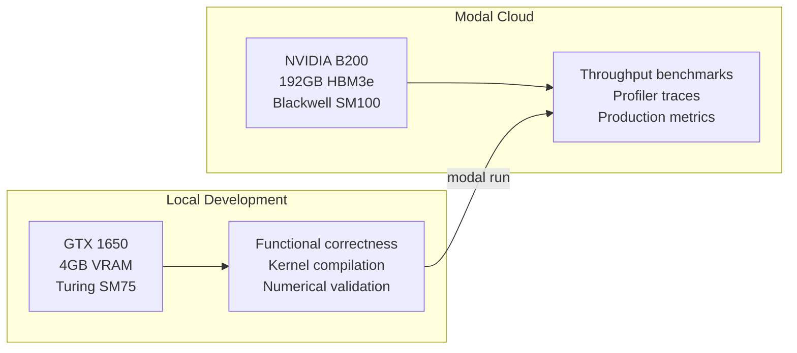
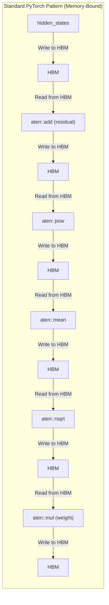
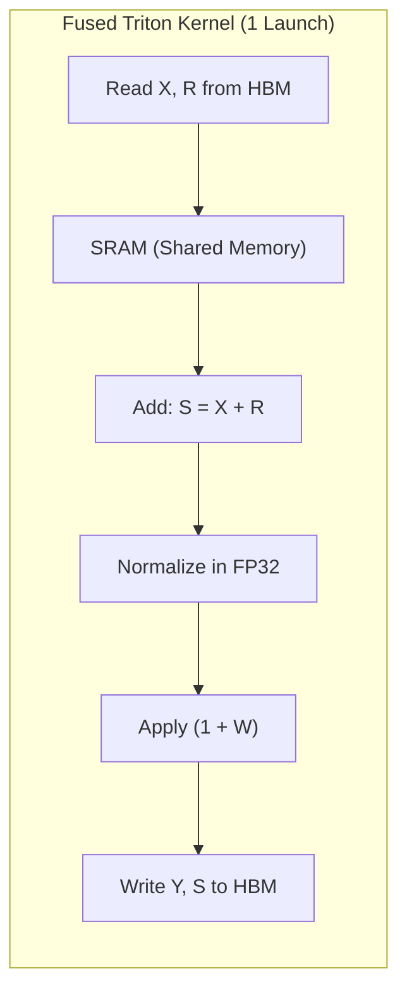
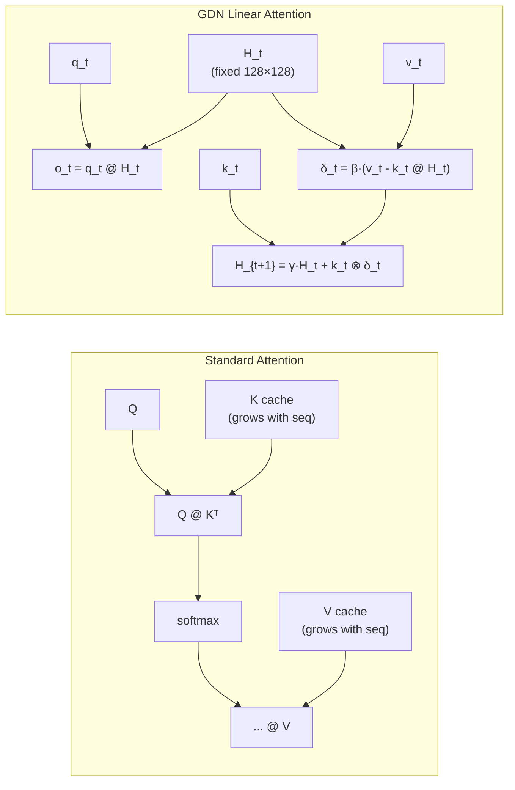
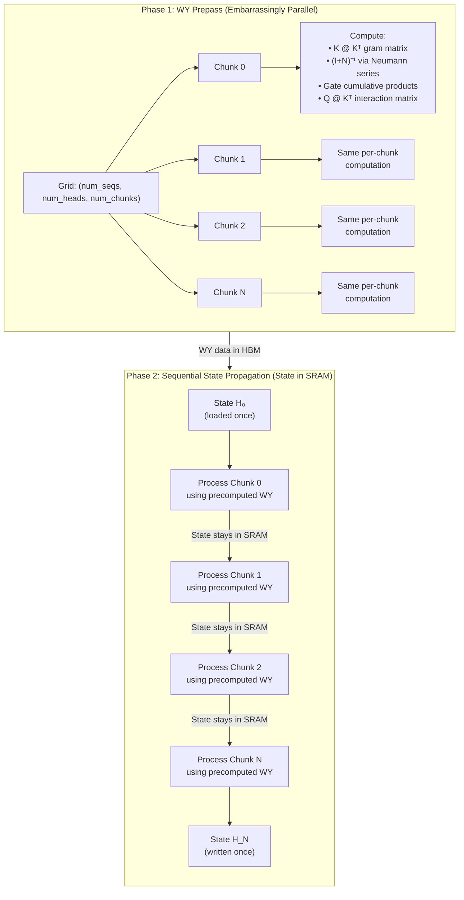

# Breaking PyTorch Boundaries: Fusing RMSNorm and GDN in Triton for Qwen 3.5

I rebuilt the inference stack for Qwen 3.5 (9B) from scratch in PyTorch, profiled it, and replaced the key bottlenecks with hand-written Triton GPU kernels. By fusing memory-bound operations and rewriting the Gated Delta Network (GDN) linear attention layers to run without slow Python loops, I bumped throughput from **16 to 83 tokens/second** on a single NVIDIA B200 (a 5.2x speedup).

---

## Table of Contents

- [Project Overview](#project-overview)
- [Hardware Setup](#hardware-setup)
- [Finding the Bottlenecks (Baseline Profiling)](#finding-the-bottlenecks-baseline-profiling)
- [Fusing the Residual Stream](#fusing-the-residual-stream)
- [Optimizing Gated Delta Attention](#optimizing-gated-delta-attention)
- [Triton vs. Other Frameworks](#triton-vs-other-frameworks)
- [Comparison with vLLM](#comparison-with-vllm)
- [Takeaways](#takeaways)

---

## Project Overview

Unlike vanilla transformers, Qwen 3.5 uses a **hybrid architecture** that interleaves standard multi-head attention layers with **Gated Delta Network (GDN)** linear attention layers. The GDN layers use a recurrent state-space mechanism that compresses past context into a fixed-size state matrix instead of maintaining a growing KV cache.

```
Layer 0:  Linear Attention (GDN)
Layer 1:  Linear Attention (GDN)
Layer 2:  Linear Attention (GDN)
Layer 3:  Full Attention (SDPA)    ← every 4th layer
Layer 4:  Linear Attention (GDN)
...
Layer 31: Full Attention (SDPA)
```

Because **75% of the decoder layers** are GDN layers, optimizing them is critical—they dominate both prefill and decode latency.

The goal here wasn't to build a production serving system, but to understand what happens between the CUDA cores and HBM when you run text generation, and to see how much performance we can recover through targeted Triton kernels.

### Code Components

| Component | Description |
|---|---|
| [qwen.py](https://github.com/Darshan-Baslani/qwen3.5-optimized/blob/main/qwen.py) | Custom PyTorch implementation of the full Qwen 3.5 model (983 LOC) |
| [fused_zero_centered_rmsnorm.py](https://github.com/Darshan-Baslani/qwen3.5-optimized/blob/main/kernels/triton/fused_zero_centered_rmsnorm.py) | Triton kernel fusing residual additions and zero-centered RMSNorm |
| [prefill.py](https://github.com/Darshan-Baslani/qwen3.5-optimized/blob/main/kernels/linear_attention/prefill.py) | Triton chunkwise GDN prefill kernel using WY decomposition (993 LOC) |
| [decode.py](https://github.com/Darshan-Baslani/qwen3.5-optimized/blob/main/kernels/linear_attention/decode.py) | Triton single-token GDN decode kernel |
| [modal/inference.py](https://github.com/Darshan-Baslani/qwen3.5-optimized/blob/main/modal/inference.py) | Inference pipeline deployed to Modal (NVIDIA B200) |
| [modal/vllm_bench.py](https://github.com/Darshan-Baslani/qwen3.5-optimized/blob/main/modal/vllm_bench.py) | Benchmarking script comparing our performance against vLLM |

---

## Hardware Setup

I developed local tests on a GTX 1650 to iterate fast, and ran final benchmarks on an NVIDIA B200 via Modal.



| Platform | Local Development | Cloud Benchmark |
|---|---|---|
| **GPU** | GTX 1650 (Turing SM75) | NVIDIA B200 (Blackwell SM100) |
| **VRAM** | 4 GB GDDR6 | 192 GB HBM3e |
| **Memory Bandwidth** | 128 GB/s | 8,000 GB/s |
| **Role** | Fast functional testing | Throughput and profiling |

### Profiling Setup

I captured profiler traces on the B200 using PyTorch's built-in `torch.profiler` with CPU + CUDA activity recording and memory tracking. The profiling script ([inference-torch-profiler.py](https://github.com/Darshan-Baslani/qwen3.5-optimized/blob/main/modal/inference-torch-profiler.py)) profiles the prefill pass and a few decode steps, exporting Chrome traces for analysis.

I ran profiles at three main development stages:

> [!WARNING]
> **Profiling Overhead:** The absolute times in the traces are much slower than actual inference because the profiler (with memory tracking and `CUDA_LAUNCH_BLOCKING=1`) adds significant overhead. The throughput numbers below reflect actual, unprofiled runs, while the trace times show the relative gains under profiling conditions.

| Trace | Stage | Profiled Time (with overhead) | Actual Throughput |
|---|---|---|---|
| `initial_trace.json` | Pure PyTorch baseline | 10.53 s | ~16 tok/s |
| `fused_rms_norm.json` | + Fused Triton RMSNorm | 10.40 s | ~50 tok/s |
| `triton_linear_attention.json` | + Triton GDN kernels | 6.51 s | ~83 tok/s |

---

## Finding the Bottlenecks

### The Initial Trace

I started by profiling the baseline PyTorch model on the B200 to see where the actual execution time was spent.


The trace showed a classic memory-bandwidth bottleneck. A single decode step—which should ideally consist of a few fused operations—was launching dozens of tiny individual CUDA kernels:

```
aten::add          →  50 µs  (residual addition)
aten::pow          →  30 µs  (variance computation)
aten::mean         →  40 µs  (reduction for RMSNorm)
aten::rsqrt        →  20 µs  (inverse sqrt)
aten::mul          →  25 µs  (weight application)
aten::to           →  15 µs  (dtype cast)
```

Each of these operations touches HBM—reading the hidden state (8 KB per token), performing one arithmetic step, and writing the result back. The real bottleneck wasn't the arithmetic; it was the kernel launch overhead and memory roundtrips.

### The Abstraction Bottleneck

The standard PyTorch pattern treats each layer and operation as an isolated object:



That means **six HBM round-trips for a single normalization**. On the B200, each round-trip for a 4096-dim hidden state costs very little time in raw transfer, but the launch overhead for each tiny kernel is 20-50 µs. Multiply that by 32 layers and 2 norms per layer, and you get **64 normalization passes per decode step**.

Essentially, PyTorch's module abstraction (where each layer/operation is a self-contained forward pass) forces separate kernel launches and intermediate memory writes, which kills performance on the GPU.

---

## Fusing the Residual Stream

### Passing the Residual Stream Down

To fix this, we can adopt a trick used by systems like vLLM: pass the residual stream as an independent tensor so that the next layer's normalization kernel can fuse both the addition and the normalization step.

Instead of:

```python
# Standard: Layer owns its residual
hidden = layer_norm(hidden + residual)
```

We restructure the decoder to return both:

```python
# Fused: Residual flows between layers
hidden, residual = fused_norm(hidden, residual)
```

### The Fused Triton Kernel

Here is the Triton implementation:

```python
@triton.jit
def _fused_zero_centered_rmsnorm(
    Y_ptr, Y_row_stride,
    S_ptr, S_row_stride,     # output residual
    X_ptr, X_row_stride,
    R_ptr, R_row_stride,     # input residual
    W_ptr, n_cols, eps,
    BLOCK_SIZE: tl.constexpr,
):
    row_idx = tl.program_id(0)
    col_offsets = tl.arange(0, BLOCK_SIZE)
    mask = col_offsets < n_cols

    # Step 1: Load X and R from HBM (the ONLY HBM read)
    X_row = tl.load(X_ptr + row_idx * X_row_stride + col_offsets, mask=mask)
    R_row = tl.load(R_ptr + row_idx * R_row_stride + col_offsets, mask=mask)

    # Step 2: Fused residual add (stays in SRAM)
    S_row = X_row + R_row
    tl.store(S_ptr + row_idx * S_row_stride + col_offsets, S_row, mask=mask)

    # Step 3: RMSNorm in FP32 (stays in SRAM)
    S_row = S_row.to(tl.float32)
    W_row = tl.load(W_ptr + col_offsets, mask=mask).to(tl.float32)

    mean_square = tl.sum(S_row * S_row, axis=0) / n_cols
    rstd = tl.rsqrt(mean_square + eps)
    S_row = S_row * rstd

    # Step 4: Zero-centered weight trick (Qwen-specific)
    Y_row = S_row * (1.0 + W_row)

    # Step 5: Write normalized output to HBM (the ONLY HBM write)
    tl.store(Y_ptr + row_idx * Y_row_stride + col_offsets, Y_row.to(S_row_dtype), mask=mask)
```

### Key Implementation Details

1. **Zero-Centered Weights:** Standard RMSNorm applies `output = norm(x) * weight`. Qwen 3.5 uses zero-centered weights initialized at 0, applying `output = norm(x) * (1.0 + weight)`. Standard RMSNorm kernels will output incorrect activations and cause the model to diverge.
2. **FP32 Accumulation:** We must upcast the accumulated sum to FP32 before computing the variance. BF16's limited precision causes compounding rounding errors across 32 layers, leading to numerical divergence.
3. **Dual Outputs:** The kernel outputs the normalized hidden state `Y` and the new residual `S` in one go. While `S` still gets written to HBM for the next layer, the fusion eliminates 5 intermediate round-trips and launches.

### Memory Traffic and Kernel Launches



| Metric | Before (PyTorch) | After (Fused Triton) |
|---|---|---|
| HBM round-trips per norm | 6 | 1 |
| Kernel launches per norm | 6 | 1 |
| Total norms per decode step | 64 | 64 |
| Kernel launches eliminated | — | **320 per step** |

### Restructuring the Decoder Layer

We also need to map the standard HuggingFace weights into our fused model format during loading (duplicating `input_layernorm.weight` into both a `standard` and `fused` slot).

```python
class Qwen3_5DecoderLayer(nn.Module):
    def forward(self, hidden_states, residual, ...):
        if residual is None:
            # First layer: no residual yet, use standard norm
            residual = hidden_states
            hidden_states = self.input_layernorm_standard(hidden_states)
        else:
            # Subsequent layers: fused residual + norm
            hidden_states, residual = self.input_layernorm_fused(X=hidden_states, R=residual)

        # Token mixer (attention or GDN)
        hidden_states = self.token_mixer(hidden_states)

        # Post-attention: always fused
        hidden_states, residual = self.post_attention_layernorm(X=hidden_states, R=residual)
        hidden_states = self.mlp(hidden_states)

        return hidden_states, residual  # ← residual flows to next layer
```

### Performance Gains (Stage 1)


| Implementation | Throughput (B200, 150 tokens) |
|---|---|
| Pure PyTorch baseline | ~16 tok/s |
| + Fused Triton RMSNorm | **~50 tok/s** (3.1x speedup) |

Fusing RMSNorm and residual addition got us to ~50 tokens/sec. However, the profiler showed we were still heavily bottlenecked by the Gated Delta Network (GDN) linear attention layers, which were still running in pure PyTorch with sequential Python loops.

---

## Optimizing Gated Delta Attention

### GDN Attention vs. Standard Attention

Standard multi-head attention processes all tokens in parallel via $Q K^\top V$. The KV cache grows linearly with sequence length, but the attention computation itself is highly parallelizable.

GDN linear attention works differently. It maintains a **fixed-size recurrent state matrix** $H \in \mathbb{R}^{K \times V}$ (128 × 128 = 16 KB per head) that compresses all past context:



The recurrence relation for each token:

$$H_{t+1} = \gamma_t \cdot H_t + k_t \otimes \beta_t \cdot (v_t - k_t^\top H_t)$$
$$o_t = q_t^\top \cdot H_{t+1}$$

Where the learned gating decay $\gamma_t$ is defined as:
$$\gamma_t = \exp\left(-\exp(A_{\text{log}}) \cdot \text{softplus}(a_t + \text{dt}_{\text{bias}})\right)$$

### The Bottleneck: Sequential Loops in PyTorch

The initial PyTorch implementation processed chunks sequentially using a Python `for` loop:

```python
# The bottleneck: sequential iteration
for i in range(total_sequence_length // chunk_size):
    q_i, k_i, v_i = query[:, :, i], key[:, :, i], value[:, :, i]
    attn = q_i @ k_i.transpose(-1, -2) * decay_mask[:, :, i]
    v_prime = k_cumdecay[:, :, i] @ last_recurrent_state  # ← HBM read
    v_new = v_i - v_prime
    attn_inter = (q_i * g[:, :, i, :, None].exp()) @ last_recurrent_state  # ← HBM read
    core_attn_out[:, :, i] = attn_inter + attn @ v_new
    last_recurrent_state = (  # ← HBM write, then read again next iteration
        last_recurrent_state * g[:, :, i, -1, None, None].exp()
        + (k_i * ...).transpose(-1, -2) @ v_new
    )
```

For a prefill sequence of 512 tokens with a chunk size of 64, we have $\frac{512}{64} = 8$ chunks. In every loop iteration:
1. **Read** the recurrent state matrix $H$ from HBM (128 × 128 float32 elements = 64 KB/head × 32 heads = 2 MB total).
2. Perform small matrix multiplications.
3. **Write** the updated 2 MB state matrix back to HBM.
4. Yield execution back to Python to start the next iteration.

This results in:
$$\text{Total HBM Traffic} = 8 \text{ chunks} \times (2\text{ MB read} + 2\text{ MB write}) = 32\text{ MB}$$

This is 32 MB of redundant memory transfers per layer. All of this state could instead live entirely in the GPU's SRAM (shared memory) during the entire forward pass.

### Writing the Triton Chunkwise GDN Kernel

To parallelize this, we use the chunkwise formulation from the [Flash Linear Attention (FLA)](https://github.com/fla-org/flash-linear-attention) paper: intra-chunk interactions are computed in parallel via matrix multiplications, while the inter-chunk state updates are propagated sequentially while keeping the state matrix in SRAM.

#### Prefill Kernel Architecture

The prefill is split into two phases for maximum parallelism:



#### The WY Decomposition

The intra-chunk math uses the delta rule to formulate a lower-triangular system:

$$(I + N) \cdot X = \beta \cdot \left(\frac{V}{G} - K \cdot S_{\text{in}}^\top\right)$$

Where $N$ is a strictly lower-triangular nilpotent matrix ($N[j,i] = \beta_j \cdot (k_j \cdot k_i)$ for $i < j$). Since $N$ is nilpotent of order $C$ (chunk size), we can invert $(I+N)$ exactly using the Neumann series:

$$(I + N)^{-1} = (I - N)(I + N^2)(I + N^4) \cdots$$

This is implemented as a fixed-depth doubling chain:

```python
@triton.jit
def _apply_unit_lower_inverse(nil, rhs, BV: tl.constexpr, CHUNK: tl.constexpr):
    """(I+N)^{-1} via doubling. Uses TF32 tensor cores for numerical stability."""
    sol = rhs - _dot_f32(nil, rhs)        # (I - N) @ rhs
    power = _dot_f32(nil, nil)             # N²
    if CHUNK >= 4:
        sol = sol + _dot_f32(power, sol)   # += N² @ sol
        power = _dot_f32(power, power)     # N⁴
    if CHUNK >= 8:
        sol = sol + _dot_f32(power, sol)   # += N⁴ @ sol
        power = _dot_f32(power, power)     # N⁸
    if CHUNK >= 16:
        sol = sol + _dot_f32(power, sol)   # += N⁸ @ sol
        power = _dot_f32(power, power)     # N¹⁶
    if CHUNK >= 32:
        sol = sol + _dot_f32(power, sol)   # += N¹⁶ @ sol
    return sol
```

#### Blackwell-Specific Optimizations

Getting clean performance on the B200 required a few low-level adjustments:

1. **Precision Splitting (TF32 vs. BF16):** The nilpotent inverse chain uses TF32 (19-bit mantissa) since numerical errors compound quickly across the log-depth doubling chain. For the large K=128 contractions (`K @ K^T`, `Q @ state^T`), we use BF16 tensor cores to get a 4x speedup, where rounding is bounded for single-shot matmuls.
2. **Blackwell Code-Gen Bug:** We hit a bug in Triton's compiler on Blackwell (specifically the `TritonGPUHoistTMEMAlloc` pass) where it incorrectly fused `tl.dot` outputs. We bypassed it by wrapping the dot product in an inline PTX `mov.f32` barrier:

```python
@triton.jit
def _dot_f32(a, b):
    out = tl.dot(a, b, input_precision="tf32", out_dtype=tl.float32)
    return tl.inline_asm_elementwise(
        asm="mov.f32 $0, $1;",
        constraints="=r,r",
        args=[out], dtype=tl.float32, is_pure=True, pack=1,
    )
```

3. **Adaptive Tiling:** We adjusted tile sizes dynamically depending on the workload:

| Parameter | Small Batch | Large Batch | Rationale |
|---|---|---|---|
| `CHUNK` | 32 | 16 | Larger chunks amortize launch overhead; smaller chunks save Gram matrix computation |
| `BV` (V-tile) | 16 | 16-32 | Controls shared memory occupancy vs. register pressure |
| `num_warps` | 4 | 2 | Reduces sync overhead on smaller sequence batches |

#### The Decode Kernel

For the single-token decode kernel, things are simpler since we don't need chunking. We map the grid over batch and heads:

1. Load the state tile $H[\text{BV}, K]$ from HBM (single read).
2. Compute the gate decay value $\gamma = \exp\left(-\exp(A_{\text{log}}) \cdot \text{softplus}(a + \text{dt}_{\text{bias}})\right)$.
3. Run the recurrent update step directly in registers.
4. Write out the output token and the new state back to HBM.

```python
@triton.jit
def gdn_decode_kernel(...):
    # Gate computation
    g = tl.exp(-tl.exp(A_log_val) * softplus_x)
    beta = tl.sigmoid(b_val)

    # Decay existing state
    old_state = g * b_h

    # Delta rule update
    old_v = tl.sum(old_state * b_k[None, :], axis=1)
    delta_v = beta * (b_v - old_v)

    # Output BEFORE state update (frees registers)
    old_o = tl.sum(old_state * b_q[None, :], axis=1)
    kq = tl.sum(b_k * b_q)
    b_o = scale * (old_o + delta_v * kq)
    tl.store(out_ptr + ..., b_o.to(tl.bfloat16))

    # State update (register-only, no extra HBM read)
    state_out = old_state + delta_v[:, None] * b_k[None, :]
    tl.store(new_state_ptr + ..., state_out)
```

> [!TIP]
> Storing the output *before* computing `state_out` frees up registers and prevents local memory spilling. Since Blackwell caps registers at 255 per thread, this manual scheduling prevents register spills.

### Performance Gains (Stage 2)


| Implementation | End-to-End Time (150 tok) | Throughput |
|---|---|---|
| Pure PyTorch baseline | 9.28 s | ~16 tok/s |
| + Fused Triton RMSNorm | 3.02 s | ~50 tok/s |
| + Triton GDN Kernels | 1.81 s | **~83 tok/s** (5.2x speedup) |

---

## Triton vs. Other Frameworks

When choosing how to write these kernels, there were three main options:

1. **Triton:** Fast iteration, Python-based, portable. But we lose low-level control over TMA (Tensor Memory Accelerator) and ran into compiler bugs on Blackwell.
2. **TileLang:** Good compromise, offers warp specialization and better occupancy control, but the ecosystem is very young.
3. **CuTe / CUTLASS (C++):** Maximum performance, explicit layout swizzling, and full control over asynchronous memory copies. But it requires writing 3,000+ lines of C++ template metaprogramming per kernel, adding weeks of development.

### Where Triton Falls Short on Blackwell

Writing kernels for the B200 highlighted a few areas where Triton's compiler abstractions hit limits:
- **TMA Control:** The B200 features a Tensor Memory Accelerator to prefetch data asynchronously. Triton abstracts this, meaning we cannot manually orchestrate tile prefetching or schedule memory loads.
- **Swizzle Layouts:** Preventing bank conflicts in shared memory requires specific data layouts. Triton manages this automatically but can generate suboptimal swizzling patterns for non-power-of-two tiles.
- **Compiler Bugs:** The code-generation bug in `TritonGPUHoistTMEMAlloc` meant we had to resort to inline PTX assembly barriers.

### Why I Stuck With Triton

Even with these issues, Triton was the right choice for this project:

| Factor | Triton | CuTe/CUTLASS |
|---|---|---|
| Iteration Time | Minutes | Hours (compile + run) |
| Lines of Code | ~1,100 total | ~3,000+ per kernel |
| Maintainability | High (Python-like syntax) | Low (highly complex C++ templates) |
| Throughput | 83 tokens/s | Theoretical peak (maybe ~90 tok/s) |
| Development Time | 2 weeks | 2+ months(I have fulltime college :( ) |

Ultimately, hitting 83 tokens/second in a couple of weeks with Triton is a much better engineering tradeoff than spending months in C++ to chase a marginal single-digit performance gain.

---

## Comparison with vLLM

To see where these optimizations stand relative to a production serving system, I benchmarked our setup against vLLM on the same B200 hardware:

| System | Throughput | Setup |
|---|---|---|
| Custom Triton Kernels | **83 tok/s** | Single request, no batching, raw Triton kernels |
| vLLM v0.20.1 | **~250 tok/s** | Production stack (PagedAttention, CUDA Graphs, scheduling) |

### Analyzing the Performance Difference

The 3x throughput gap is due to systems-level architecture rather than raw kernel execution speeds:

| Optimization | Custom Pipeline | vLLM |
|---|---|---|
| **CUDA Graphs** | No (adds CPU overhead per decode step) | Yes (captures and replays decode graphs) |
| **Continuous Batching**| No (runs single request at a time) | Yes (batches active requests dynamically) |
| **PagedAttention** | No (pre-allocates flat tensors) | Yes (dynamic KV page management) |
| **Decode Loop** | Python-driven loop | Optimized C++ scheduling / engine |

In a production environment, kernel and systems-level optimizations are complementary. The custom Triton kernels developed here could be plugged directly into an engine like vLLM to gain the benefits of PagedAttention and CUDA Graphs.

### When to Stop Optimizing

At 83 tokens/second, we hit the point of diminishing returns for kernel optimization:
- Getting from 16 to 83 tokens/sec required about 1,100 lines of Triton.
- To push past 83 tokens/sec, we would need to eliminate CPU launch overhead using CUDA Graphs (a system orchestration task) or rewrite the kernels in CuTe to squeak out a few percentage points of memory efficiency.

Because the core performance bottleneck is now CPU dispatch and framework overhead, further micro-tuning the Triton kernels wouldn't make sense.

---

## Takeaways

Writing high-performance GPU kernels is mostly about respecting the memory hierarchy:
1. **Keep data in SRAM:** Moving intermediate states back and forth to HBM wastes bandwidth. Keep inputs in shared memory as long as possible.
2. **Minimize kernel launches:** Fusing dependent operations (like residual additions and normalization) cuts launch overhead.
3. **Eliminate Python loops:** Replace sequential execution paths with chunked, parallel CUDA blocks.

### Quick Stats

- **Model:** Qwen 3.5-9B (hybrid GDN + multi-head attention)
- **Hardware:** NVIDIA B200 (192 GB HBM3e)
- **Baseline Speed:** 16 tokens/s
- **Optimized Speed:** 83 tokens/s (5.2x speedup)
- **Triton Code:** ~1,100 lines
- **PyTorch Model Code:** ~983 lines

---

*Built by Darshan Baslani. Kernels prototyped on a GTX 1650, benchmarked on NVIDIA B200 via Modal.*

*Source: [github.com/Darshan-Baslani/qwen3.5-optimized](https://github.com/Darshan-Baslani/qwen3.5-optimized)*
